<div align="center">

<br>

# ⚕️ PROTOCOLO P8

### Reprogramação Metabólica e Modulação Microbiana<br>para Remissão do Câncer

**Guia Completo para Implementação Clínica**

<br>

[](https://orcid.org/0009-0005-1879-7016)
[](https://doi.org/10.5281/zenodo.18896354)

[](https://github.com/sebastiaoabreu/protocolo-p8)
[](https://creativecommons.org/licenses/by-nc-nd/4.0/)
[](https://doi.org/10.5281/zenodo.18896354)

<br>

*Organização e Pesquisa:* **Sebastião de Abreu Cavalcante**  
*Pesquisador Independente*

<br>

> *"Encontramos o caminho para a remissão. Agora precisamos implementá-lo."*

<br>

**Propósito:** Transformar o tratamento do câncer globalmente

</div>

---

[TOC]

<details>
<summary><strong>📑 SUMÁRIO — Clique para expandir</strong></summary>

<br>

**SEÇÕES PRELIMINARES**
- [Licença e Termos de Uso](#-licença-e-termos-de-uso)
- [Certificação de Revisão Técnica](#-certificação-de-revisão-técnica-versão-10--11)
- [Nota Essencial ao Leitor](#️-nota-essencial-ao-leitor)
- [Aviso Legal de Não-Garantia](#-aviso-legal-de-não-garantia-disclaimer-jurídico)
- [Prefácio: A Jornada Metabólica](#prefácio-a-jornada-metabólica)
- [Resumo Executivo](#-resumo-executivo--por-que-este-protocolo-é-diferente)
- [Responsabilidade e Segurança](#️-responsabilidade-e-segurança)
- [Guia de Navegação](#-guia-de-navegação-como-usar-este-manual)

**PARTE I: A DESCOBERTA**
- [Cap. 1 — O Câncer Não É O Que Nos Disseram](#capítulo-1-o-câncer-não-é-o-que-nos-disseram)
- [Cap. 2 — O Ecossistema da Cura](#capítulo-2-o-ecossistema-da-cura)
- [Cap. 3 — Estratificação Obrigatória do TMAO](#capítulo-3-estratificação-obrigatória-do-tmao-por-tipo-de-câncer)
- [Cap. 4 — O Metabolismo Como Arma](#capítulo-4-o-metabolismo-como-arma--a-engenharia-da-fome-seletiva)
- [Cap. 5 — O Tempo Como Terapia](#capítulo-5-o-tempo-como-terapia--a-cronobiologia-oncológica)
- [Cap. 6 — A Sinergia do Protocolo P8](#capítulo-6-a-sinergia-do-protocolo-p8)
- [Cap. 7 — O Modelo P8: A Arquitetura da Remissão](#capítulo-7-o-modelo-p8--a-arquitetura-da-remissão)

**PARTE II: IMPLEMENTAÇÃO SEGURA**
- [Cap. 8 — Contraindicações e Precauções](#capítulo-8-contraindicações-e-precauções)
- [Cap. 9 — Protocolo Completo: Passo a Passo](#capítulo-9-protocolo-completo--passo-a-passo)
- [Cap. 10 — Intervenções Avançadas](#capítulo-10-intervenções-avançadas--sob-supervisão-médica)
- [Cap. 11 — Casos Clínicos Ilustrativos](#capítulo-11-casos-clínicos-ilustrativos)
- [Cap. 12 — Implementação Prática e Custos](#capítulo-12-implementação-prática-e-custos)

**PARTE III: A CIÊNCIA POR TRÁS**
- [Cap. 13 — Referências Científicas Principais](#capítulo-13-referências-científicas-principais)
- [Cap. 14 — Leituras Recomendadas e Recursos](#capítulo-14-leituras-recomendadas-e-recursos)

**APÊNDICES**
- [Apêndice A — Lista de Suplementos por Nível de Custo](#apêndice-a-lista-completa-de-suplementos-por-nível-de-custo)
- [Apêndice B — Modelo de Registro Diário](#apêndice-b-modelo-de-registro-diário)
- [Apêndice C — Protocolo de Emergência](#apêndice-c-protocolo-de-emergência)
- [Apêndice D — Glossário de Termos](#apêndice-d-glossário-de-termos)
- [Apêndice E — Perguntas Frequentes (FAQ)](#apêndice-e-perguntas-frequentes-faq)
- [Apêndice F — Resumos Visuais (Para Colar na Geladeira)](#apêndice-f-resumos-visuais-para-colar-na-geladeira)

</details>

---
## 📜 LICENÇA E TERMOS DE USO

Este trabalho está licenciado sob **Creative Commons Atribuição-NãoComercial-SemDerivações 4.0 Internacional (CC BY-NC-ND 4.0)**.

### 🚨 AVISO DE SEGURANÇA E LICENÇA

Este protocolo contém diretrizes médicas críticas (como o Protocolo BACH1 e a Estratificação de TMAO). Para garantir a segurança dos pacientes e proteger a autoria intelectual contra exploração comercial não autorizada, este trabalho está licenciado sob **Creative Commons Atribuição-NãoComercial-SemDerivações 4.0 Internacional (CC BY-NC-ND 4.0)**.

**O que isso significa:**

* ✅ Você **PODE** e **DEVE** compartilhar, copiar e distribuir o arquivo original livremente para fins pessoais, educacionais e de saúde.
* 🚫 Você **NÃO PODE** usar este material para fins comerciais (vender, imprimir para venda, embutir em cursos pagos ou publicar via editoras) sem autorização prévia, expressa e contratual do autor.
* 🚫 Você **NÃO PODE** alterar, editar, cortar ou modificar o texto original.
* 🚫 Você **NÃO PODE** distribuir traduções sem revisão e aprovação oficial do autor.

**QUER AJUDAR A TRADUZIR OU PUBLICAR COMERCIALMENTE?**

Se você deseja traduzir o Protocolo P8 para seu idioma ou representa uma editora interessada na publicação da obra, entre em contato direto com o autor para autorização e negociação de direitos.

*Dessa forma, garantimos que ninguém receberá uma versão com erros de dosagem ou omissão de alertas de segurança.*

---

### 🔬 CERTIFICAÇÃO DE REVISÃO TÉCNICA (Versão 1.0 / 1.1)

Toda a pesquisa, estruturação lógica e curadoria deste protocolo são de **autoria intelectual humana e independente**.

Para garantir o mais alto nível de precisão matemática e segurança clínica, o manuscrito final foi submetido a uma **Auditoria Técnica Cruzada (Data Cross-Validation)** antes de sua primeira publicação pública. Neste processo, cinco modelos de inteligência artificial de ponta (Claude Opus 4.5, Gemini 3.1 Pro, DeepSeek R1, Grok 4 e Qwen 3.5 Plus) foram utilizados **exclusivamente como ferramentas de estresse e verificação de dados** em Fevereiro/Março de 2026.

**O escopo da auditoria algorítmica incluiu:**

1. Verificação cruzada de todas as dosagens com bancos de dados toxicológicos
2. Validação de interações medicamentosas (ex: antioxidantes vs. ferroptose)
3. Auditoria de consistência bibliográfica
4. Análise de segurança para populações especiais (imunossuprimidos, renais, hepáticos)

*As recomendações de segurança resultantes desta auditoria, combinadas com a minha análise crítica, foram incorporadas nesta versão definitiva.*

**Nota sobre a Versão 1.1:** Os certificados de auditoria da v1.0 permanecem válidos, pois a v1.1 contém apenas correções bibliográficas (Referência 39) e notas explicativas adicionais, sem alteração nas condutas clínicas, dosagens ou contraindicações.

---

# ⚠️ NOTA ESSENCIAL AO LEITOR

Este documento apresenta uma síntese de descobertas científicas emergentes sobre o metabolismo do câncer e estratégias integrativas. Os casos de remissão documentados são baseados em princípios reais, mas cada paciente é único.

**ESTE PROTOCOLO É PROPOSTO COMO COMPLEMENTO AO TRATAMENTO CONVENCIONAL, NÃO COMO SUBSTITUTO.**

A ciência demonstra que pacientes que abandonam tratamento convencional por terapias alternativas não validadas têm **2,5x a 5,7x maior risco de morte** (Johnson SB et al., JAMA Oncology, 2018; DOI: 10.1001/jamaoncol.2018.2487). Este protocolo foi desenhado para **potencializar** cirurgia, quimioterapia, radioterapia e imunoterapia — não para substituí-las.

**Consulte sempre sua equipe médica.**

---

## 🚨 AVISO LEGAL DE NÃO-GARANTIA (DISCLAIMER JURÍDICO)

**1. Ausência de Promessa de Cura:** O uso dos termos "cura", "remissão" ou "tratamento" neste documento refere-se exclusivamente a **relatos de casos observacionais** e mecanismos teóricos descritos na literatura científica citada. **Não há, explícita ou implicitamente, qualquer garantia de que o leitor obterá os mesmos resultados.** O câncer é uma doença multifatorial e imprevisível.

**2. Natureza Educacional:** Este material é um compêndio de informações bibliográficas e não constitui prescrição médica. O autor não exerce a medicina e não realiza diagnósticos. A aplicação de qualquer estratégia aqui descrita é considerada **auto-experimentação (biohacking)** e é de inteira e exclusiva responsabilidade do leitor.

**3. Isenção de Responsabilidade:** Ao prosseguir com a leitura, você concorda expressamente em isentar o autor e quaisquer distribuidores deste material de qualquer responsabilidade civil ou criminal por danos, lesões, agravamento de quadros clínicos ou óbito decorrentes do uso – correto ou incorreto – das informações aqui contidas.

---

# PREFÁCIO: A JORNADA METABÓLICA

O câncer mata cerca de 10 milhões de pessoas por ano. Durante o último meio século, declaramos uma guerra trilionária contra esta doença, focando todo o nosso arsenal bélico e intelectual em um único alvo: a genética.

Fomos ensinados que o câncer era uma loteria macabra de mutações no DNA. Células normais que, por puro azar ou exposição a toxinas, enlouqueciam e começavam a se multiplicar sem controle. Sob este modelo, a única solução lógica era envenenar, queimar ou cortar essas células rebeldes. E embora a cirurgia, a quimioterapia e a radioterapia tenham salvado milhões de vidas, para a esmagadora maioria dos cânceres sólidos avançados, os ganhos de sobrevida medem-se frequentemente em meses, não em décadas.

**Algo fundamental estava faltando na nossa compreensão.**

A verdade é que estávamos olhando para a consequência e ignorando a causa. Já em 1924, o cientista alemão Otto Warburg — que viria a ganhar o Prêmio Nobel — observou algo que a oncologia moderna preferiu esquecer durante décadas: as células cancerígenas têm um motor de energia fundamentalmente quebrado.

Enquanto uma célula saudável respira oxigênio de forma eficiente usando suas mitocôndrias, a célula cancerígena é primitiva. Ela fermenta glicose, mesmo quando há oxigênio abundante. Ela é viciada em açúcar e glutamina. O câncer não é, na sua gênese primária, uma doença genética. **O câncer é uma doença metabólica.** As mutações no DNA surgem *depois* da mitocôndria falhar, como um grito de desespero de uma célula tentando sobreviver em um ambiente asfixiante.

Esta mudança de paradigma muda tudo. Se o câncer é uma doença metabólica e inflexível, significa que **podemos matá-lo de fome seletivamente**, cortando o seu combustível principal, enquanto nutrimos nossas células saudáveis com uma fonte de energia alternativa (corpos cetônicos).

Mas a história não termina na mitocôndria.

Na última década, a ciência fez uma descoberta ainda mais assombrosa: o exército que nos protege do câncer — o nosso sistema imunológico — recebe suas ordens a partir do intestino. Descobrimos que a nossa microbiota intestinal produz moléculas (metabólitos como o TMAO e o Butirato) que viajam pela corrente sanguínea, entram no tumor e literalmente "ligam" ou "desligam" a capacidade das nossas células de defesa atacarem o câncer.

De repente, a nutrição deixou de ser apenas "comer bem para ficar forte" e passou a ser **engenharia biológica de precisão**.

**A Gênese do Protocolo P8**

Por que você não ouve falar disso no consultório do seu oncologista? Porque a medicina moderna tornou-se hiper-especializada e fragmentada. O geneticista não fala com o nutricionista; o imunologista não estuda o ritmo circadiano; o oncologista não tem tempo para investigar a microbiota.

O **Protocolo P8** nasceu da urgência de unificar estas ilhas de conhecimento. Foi criado para compilar décadas de bioquímica, descobertas recentes da *Science* e da *Nature*, e a sabedoria da cronobiologia, em um único sistema executável. O "8" representa os oito pilares de um cerco total à doença.

Mas o "8" carrega também um segundo significado. Quando deitado, o número oito se transforma no símbolo do infinito (∞) — e isso não é acidental.

O Protocolo P8 não é um documento estático. Ele nasce com a humildade de reconhecer que a ciência avança, que novos estudos surgirão, e que algumas das hipóteses aqui apresentadas serão refinadas ou mesmo substituídas por evidências mais robustas. O "8" como infinito representa esse compromisso: a busca contínua pela verdade científica, a atualização perpétua baseada em dados, e a recusa em transformar conhecimento em dogma.

O câncer evolui. A ciência evolui. Este protocolo também evoluirá.

Não estamos propondo uma teoria alternativa para substituir a medicina. Pelo contrário. Estamos apresentando um manual de **reprogramação do terreno biológico** para que o seu corpo se torne o pior pesadelo de um tumor e, simultaneamente, o ambiente perfeito para que a quimioterapia e a imunoterapia funcionem com uma eficácia devastadora.

A ciência já descobriu as peças do quebra-cabeça. O Protocolo P8 é a imagem completa.

Encontramos o caminho. Agora, vamos percorrê-lo.

---

## 🎯 RESUMO EXECUTIVO — Por Que Este Protocolo É Diferente

### O Que É o Protocolo P8?

O Protocolo P8 é o **primeiro sistema integrado** que unifica as mais recentes descobertas científicas sobre metabolismo tumoral, microbiota intestinal, cronobiologia e imunologia em um único manual executável para combate ao câncer.

Enquanto a oncologia convencional ataca o tumor com uma arma de cada vez (cirurgia, depois quimioterapia, depois radioterapia), o P8 propõe um **cerco simultâneo em múltiplas frentes** — criando um ambiente biológico onde o tumor não consegue sobreviver E onde os tratamentos convencionais funcionam melhor.

---

### O Cerco Metabólico: 8 Frentes de Ataque Simultâneo

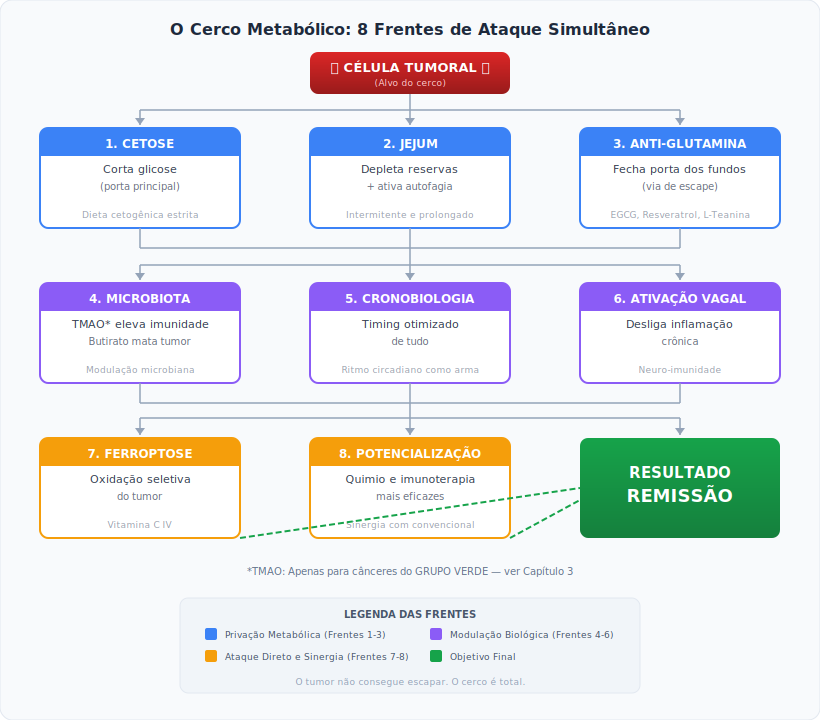

**O tumor não consegue escapar.** Se foge da cetose pela glutamina, encontra bloqueio. Se tenta crescer à noite, encontra jejum. Se recruta inflamação, encontra ativação vagal. O cerco é total.

---

### ⭐ AS 3 CONTRIBUIÇÕES ORIGINAIS DESTE PROTOCOLO

Este documento contém inovações que **não existem em nenhum outro protocolo, livro ou guideline publicado**:

#### 1. 🚦 Sistema Semáforo TMAO (Capítulo 3)

**O problema:** O TMAO (óxido de trimetilamina) foi demonizado por estudos cardiovasculares. Mas pesquisas recentes mostram que ele AJUDA em alguns cânceres e PREJUDICA em outros.

**A inovação:** Este protocolo é o primeiro a criar uma **estratificação por tipo de câncer**:

| GRUPO | CÂNCERES | ESTRATÉGIA |
|-------|----------|------------|
| 🟢 VERDE | Pâncreas, Melanoma, TNBC, Pulmão NSCLC, Glioblastoma | **ELEVAR** TMAO (15-20 μM) |
| 🟡 AMARELO | Mama (outros), Ovário, Bexiga, Esôfago, Estômago | **NEUTRO** (5-10 μM) |
| 🔴 VERMELHO | Colorretal, Próstata, Fígado, Rim, Endométrio | **SUPRIMIR** TMAO (< 5 μM) |

**Por que isso importa:** Um paciente com câncer de pâncreas que suprime TMAO está desperdiçando uma arma poderosa. Um paciente com câncer colorretal que eleva TMAO está alimentando o tumor. **A mesma molécula pode salvar ou matar, dependendo do câncer.**

Nenhum outro protocolo faz essa distinção.

---

#### 2. 🛡️ Protocolo BACH1 para Câncer de Mama (Capítulo 6.5)

**O problema:** Um estudo de 2024 (Columbia University, *Science Advances*) descobriu que a dieta cetogênica pode AUMENTAR metástases em câncer de mama através da ativação da proteína BACH1.

**O que outros fizeram:** Ignoraram ou minimizaram o estudo.

**A inovação:** Este protocolo integra o achado e cria uma **solução prática**:

```
SE: Câncer de mama (qualquer tipo) + Dieta cetogênica
ENTÃO: NAC 600-1200mg 2x/dia é OBRIGATÓRIO
```

O NAC bloqueia a via BACH1, permitindo que pacientes de mama usem cetose com segurança.

**Por que isso importa:** Mulheres com câncer de mama agora podem usar cetogênica sem o risco oculto de metástase que outros protocolos ignoram.

---

#### 3. 🔄 Integração Multivetorial Completa (Todo o documento)

**O problema:** O conhecimento existe, mas está fragmentado:
- Livros de cetogênica não falam de microbiota
- Artigos de TMAO não falam de cronobiologia
- Protocolos de jejum não falam de ativação vagal
- Ninguém integra tudo com tratamento convencional

**A inovação:** O Protocolo P8 é o **primeiro documento que unifica**:

| Disciplina | Contribuição no P8 |
|------------|-------------------|
| Metabolismo tumoral | Cetose + bloqueio de glutamina |
| Microbiota intestinal | TMAO estratificado + Butirato |
| Cronobiologia | Timing de refeições, suplementos, tratamentos |
| Neuroimunologia | Ativação vagal para controle inflamatório |
| Imunologia | Potencialização de checkpoint inhibitors |
| Farmacologia | Interações, contraindicações, sinergias |
| Medicina convencional | Integração com quimio, radio, imuno, cirurgia |

**Por que isso importa:** O câncer é uma doença sistêmica. Atacá-lo com uma intervenção isolada é como tentar apagar um incêndio com um copo d'água. O P8 traz o sistema de hidrantes completo.

---

### 📊 O QUE VOCÊ ENCONTRARÁ AQUI (E NÃO EM OUTRO LUGAR)

| Este Protocolo Oferece | Você NÃO Encontrará Em |
|------------------------|------------------------|
| Estratificação TMAO por tipo de câncer | Nenhum livro ou protocolo publicado |
| Protocolo BACH1 para mama em cetose | Nenhum guideline atual |
| Integração metabolismo + microbiota + cronobiologia | Literatura fragmentada |
| Dosagens específicas por grupo de câncer | Protocolos genéricos |
| Alertas de segurança detalhados (G6PD, DCA, etc.) | Muitos protocolos "alternativos" |
| 41 referências científicas com DOI | Afirmações sem fonte |
| Casos clínicos ilustrativos por grupo | Teoria sem aplicação |
| Rotina do dia modelo com timing | Listas de suplementos sem contexto |
| Níveis de custo (essencial → avançado) | Protocolos elitistas |

---

### 🗺️ COMO LER ESTE DOCUMENTO (Por Perfil)

#### 👤 SE VOCÊ É PACIENTE OU FAMILIAR (Com Pressa)

**Tempo mínimo: 1 hora**

1. **Capítulo 3** — Descubra seu GRUPO (Verde/Amarelo/Vermelho) ← *COMECE AQUI*
2. **Capítulo 8** — Verifique contraindicações
3. **Capítulo 9** — Veja a rotina do dia modelo
4. **Apêndice F** — Imprima os resumos visuais para a geladeira

*Depois, volte e leia o restante.*

---

#### 🩺 SE VOCÊ É ONCOLOGISTA OU MÉDICO (Cético)

**Tempo mínimo: 30 minutos**

1. **Capítulo 3** — Veja a estratificação TMAO (inovação central)
2. **Capítulo 6.4-6.5** — Evidências de sinergia cetose + imunoterapia + Protocolo BACH1
3. **Capítulo 13** — Confira as 41 referências (Science, Nature, Science Immunology, etc.)

*Se ainda cético, leia o estudo Mirji et al. 2022 (ref. 13) — Science Immunology.*

---

#### 🥗 SE VOCÊ É NUTRICIONISTA OU PROFISSIONAL INTEGRATIVO

**Tempo mínimo: 2 horas**

1. **Capítulos 1-7** — Fundamentos teóricos completos
2. **Capítulo 9** — Protocolo passo a passo
3. **Apêndice A** — Lista de suplementos por nível de custo
4. **Capítulo 11** — Casos clínicos para referência

---

#### 📚 SE VOCÊ QUER ENTENDER TUDO (Leitura Completa)

**Tempo estimado: 4-6 horas**

Leia na ordem: Prefácio → Parte I (Caps 1-7) → Parte II (Caps 8-12) → Parte III (Caps 13-14) → Apêndices

---

### ⚡ A PROMESSA DESTE DOCUMENTO

Este protocolo não promete cura. Câncer é complexo demais para promessas.

**O que ele promete:**

1. **Você terá o conhecimento mais atualizado** sobre metabolismo tumoral e microbiota disponível em língua portuguesa (ou qualquer língua).

2. **Você terá um sistema de decisão** para saber o que fazer baseado no SEU tipo de câncer.

3. **Você terá ferramentas concretas** para discutir com seu oncologista — não teorias vagas, mas referências científicas e protocolos executáveis.

4. **Você não estará mais no escuro.** O câncer prospera na ignorância do paciente. Este documento acende a luz.

---

*Agora você sabe por que este protocolo é diferente. Prossiga para a seção de Responsabilidade e Segurança, e depois comece sua jornada.*

---

## ⚠️ RESPONSABILIDADE E SEGURANÇA

**Antes de prosseguir, leia isto:**

O Protocolo P8 é uma ferramenta poderosa. Mas com grande poder vem grande responsabilidade.

**Este documento NÃO substitui:**
- ✔ Avaliação médica individualizada
- ✔ Tratamentos oncológicos convencionais comprovados
- ✔ Monitoramento profissional durante o tratamento

**Este documento OFERECE:**
- ✔ Uma síntese das mais recentes descobertas científicas
- ✔ Estratégias integrativas baseadas em evidências
- ✔ Ferramentas para você se tornar protagonista da sua cura
- ✔ Um roteiro para discutir com sua equipe médica

**REGRAS DE OURO:**

1. **NUNCA abandone o tratamento convencional** para seguir este protocolo
2. **SEMPRE informe seu oncologista** sobre tudo o que está tomando
3. **MONITORE-SE** com exames frequentes
4. **AJUSTE** baseado em resultados, nunca por teimosia
5. **GRUPO VERMELHO**: NÃO suplemente Colina/Carnitina
6. **DCA**: NUNCA use sem supervisão médica rigorosa + Tiamina (B1) 300-500mg/dia OBRIGATÓRIA
7. **CÂNCER DE MAMA em cetose**: NAC é OBRIGATÓRIO (Protocolo BACH1)

**Sua vida é o que importa. Use este protocolo com sabedoria.**

---

## 🧭 GUIA DE NAVEGAÇÃO: COMO USAR ESTE MANUAL

O Protocolo P8 é denso porque o câncer é complexo. Para evitar que você se sinta sobrecarregado, desenhamos este manual para ser lido em uma sequência estratégica.

**PASSO 1: Entenda o "Porquê" (Parte I — Capítulos 1 a 7)**

Não pule a teoria. Para ter a disciplina férrea que este protocolo exige, você precisa entender como o câncer se alimenta e como o seu corpo pode matá-lo de fome. Leia como se fosse um livro de descobertas.

**PASSO 2: A Missão Mais Importante (Capítulo 3)**

A sua primeira tarefa prática está no **Capítulo 3**. Você terá que classificar o seu tipo de câncer no Sistema Semáforo (Grupo Verde, Amarelo ou Vermelho) para o metabólito TMAO. **Tudo o que você fará depois depende dessa cor.**

**PASSO 3: O "Pedágio de Segurança" (Capítulo 8)**

Ao entrar na Parte II, você será parado no Capítulo 8 (Contraindicações e Precauções). Leia com atenção. Verifique se você tem deficiência de G6PD, problemas renais severos ou outras condições que exijam adaptação do protocolo.

**PASSO 4: Vá para a Ação (Capítulos 9 e 10)**

É aqui que a teoria vira rotina. O **Capítulo 9** contém a sua agenda diária (o Dia Modelo). O **Capítulo 10** detalha intervenções avançadas sob supervisão. O **Apêndice A** é a sua lista de compras de suplementos e o **Apêndice F** traz resumos visuais para colar na geladeira.

**PASSO 5: Inspire-se e Organize-se (Capítulos 11 e 12)**

Os **Casos Clínicos Ilustrativos** (Capítulo 11) são a prova visual de que a teoria se aplica ao mundo real. Use-os como combustível motivacional. Por fim, o **Capítulo 12** mostra como organizar a implementação prática e os custos envolvidos.

*Leve este documento ao seu médico, mostre a Parte III (As Referências Científicas) e construam juntos o seu plano de ataque.*

---


# PARTE I: A DESCOBERTA

## Capítulo 1: O Câncer Não É O Que Nos Disseram

### 1.1 A Mentira Bem-Intencionada

Durante 50 anos, fomos ensinados que o câncer é essencialmente uma doença genética — mutações aleatórias que transformam células normais em assassinas. Bilhões foram investidos em sequenciamento genômico, terapias-alvo, imunoterapias baseadas nesse modelo.

Os resultados? Para a maioria dos cânceres sólidos avançados, a sobrevida mediana aumentou semanas ou meses, não anos. A um custo de dezenas de milhares de dólares por mês de vida adicional.

**Algo fundamental estava errado no modelo.**

### 1.2 A Verdade Metabólica

Em 1924, Otto Warburg — ganhador do Nobel — observou algo que a oncologia moderna preferiu ignorar: **células cancerígenas têm metabolismo fundamentalmente diferente.** Elas fermentam glicose mesmo na presença de oxigênio. Suas mitocôndrias estão disfuncionais.

Por décadas, isso foi tratado como curiosidade bioquímica, não como alvo terapêutico.

**Isso foi um erro colossal.**

Pesquisas recentes demonstram que:

1. **A disfunção mitocondrial PRECEDE as mutações genéticas** — o metabolismo alterado causa instabilidade genômica, não o contrário

2. **Células cancerígenas são metabolicamente inflexíveis** — dependem de glicose e glutamina de forma que células normais não dependem

3. **O microambiente tumoral é metabólico** — acidose, hipóxia, competição por nutrientes determinam comportamento tumoral

4. **A microbiota intestinal modula diretamente a resposta ao câncer** — via metabólitos que alteram imunidade e metabolismo tumoral

### 1.3 A Síntese Revolucionária

O Protocolo P8 nasce da integração de descobertas de múltiplas disciplinas:

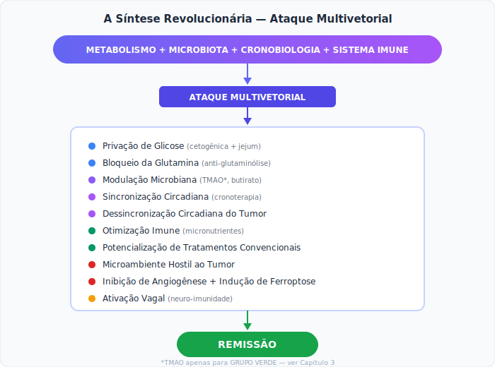

*TMAO apenas para GRUPO VERDE — ver Capítulo 3

---

## Capítulo 2: O Ecossistema da Cura

### 2.1 A Microbiota Como Quartel-General Imunológico

Durante muito tempo, a oncologia tratou o intestino apenas como um tubo de digestão. Hoje, sabemos que ele é o maior órgão imunológico do corpo humano. Cerca de 70% a 80% das suas células de defesa (sistema imune) vivem na parede intestinal, numa estrutura chamada GALT (*Gut-Associated Lymphoid Tissue*).

O seu intestino é literalmente o campo de treinamento militar do seu corpo. São os 100 trilhões de microrganismos (a microbiota) que lá habitam que "ensinam" as suas células T (linfócitos) a diferenciar o que é um tecido saudável do que é uma ameaça (como um vírus ou uma célula tumoral).

Este ecossistema produz metabólitos que não ficam restritos ao intestino; eles caem na corrente sanguínea, viajam até o local do tumor e alteram o microambiente tumoral. Nós não tratamos o intestino para melhorar a digestão do paciente oncológico; tratamos o intestino porque **é ele quem assina as ordens de ataque para o sistema imunológico**.

**Descobertas-chave:**

| Metabólito | Fonte Microbiana | Efeito no Câncer |
|------------|------------------|------------------|
| **TMAO*** | Conversão de colina/carnitina | Ativa imunidade antitumoral |
| **Butirato** | Fermentação de fibras | Induz apoptose, modula epigenética |
| **Urolitinas** | Metabolização de polifenóis | Antioxidante, anti-inflamatório |
| **Ácidos biliares secundários** | Transformação de bile | Modula proliferação |

*TMAO: Estratificado por tipo de câncer — ver Capítulo 3

**Referência-chave:** Mirji G et al. (2022). "The microbiome-derived metabolite TMAO drives immune activation and boosts responses to immune checkpoint blockade in pancreatic cancer." Science Immunology, 7(75). DOI: 10.1126/sciimmunol.abn0704

### 2.2 O Eixo Intestino-Tumor

A comunicação entre intestino e tumor é bidirecional:

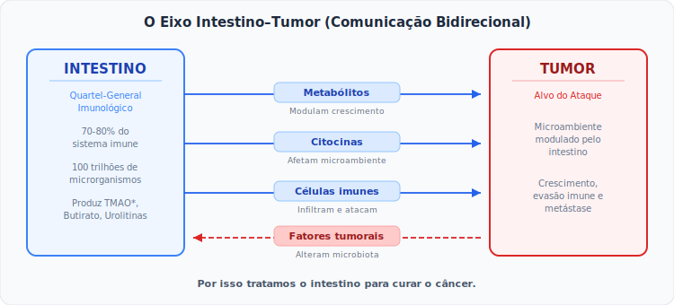

**Por isso tratamos o intestino para curar o câncer.**

### 2.3 O TMAO: De Vilão a Herói (Para Cânceres Específicos)

O TMAO (óxido de trimetilamina) foi demonizado por estudos cardiovasculares.

**Uma nota sobre vieses científicos:** A "condenação" do TMAO merece contexto crítico. Os estudos que o associaram a doenças cardiovasculares eram predominantemente observacionais — ou seja, mostravam *correlação*, não *causalidade*. Pessoas com TMAO elevado também tendiam a ter dietas ricas em ultraprocessados, sedentarismo e outros fatores de confusão que não foram adequadamente isolados.

Além disso, a biologia raramente opera em absolutos. Uma molécula que desempenha um papel num contexto (cardiovascular) pode ter função completamente diferente em outro (oncológico). O TMAO que preocupa o cardiologista pode ser exatamente o que o imunologista precisa para ativar macrófagos contra um tumor.

Este protocolo nasce com um pedido à comunidade científica: que se realizem estudos prospectivos, randomizados e bem desenhados sobre o papel do TMAO em contextos oncológicos específicos — livres dos vieses que cristalizaram prematuramente a narrativa do "vilão".

Mas a oncologia descobriu algo inesperado:

**Em cânceres específicos (GRUPO VERDE), o TMAO:**
- Transforma macrófagos M2 (pró-tumor) em M1 (antitumor)
- Potencializa checkpoint inhibitors em até 4x
- Reduz células supressoras mieloides
- Aumenta infiltração de células T citotóxicas

**⚠️ ATENÇÃO CRÍTICA:** Esta informação NÃO se aplica a todos os cânceres. Ver estratificação obrigatória no Capítulo 3.

### 2.4 O Butirato: O Guardião Universal

Diferente do TMAO, o butirato é universalmente benéfico:

**Mecanismos:**
- Inibidor de histona deacetilase (HDAC) — reativa genes supressores de tumor
- Induz apoptose seletiva em células cancerígenas
- Fortalece barreira intestinal
- Modula inflamação sistemicamente
- Não tem contraindicação por tipo de câncer

**Fontes:** Fermentação de fibras (inulina, FOS, amido resistente)  
**Suplementação direta:** 2-4g/dia (especialmente para GRUPO VERMELHO)

---


## Capítulo 3: Estratificação Obrigatória do TMAO por Tipo de Câncer

### ⚠️ SEÇÃO CRÍTICA — LEIA ANTES DE PROSSEGUIR

**O TMAO não é universalmente benéfico.** Estudos mostram que para alguns cânceres, o TMAO pode ser prejudicial. Esta estratificação é **OBRIGATÓRIA** antes de implementar qualquer protocolo relacionado ao TMAO.

**Nota sobre evidências:** A estratificação abaixo representa o melhor conhecimento científico disponível até março de 2026. Os dados em humanos ainda são limitados — a maioria das evidências vem de estudos pré-clínicos e observacionais. Ensaios clínicos randomizados em andamento trarão mais clareza nos próximos anos.

### Tabela 1: Classificação por Tipo de Câncer (Sistema Semáforo)

| GRUPO | COR | CÂNCERES | ESTRATÉGIA TMAO |
|-------|-----|----------|-----------------|
| **VERDE** | 🟢 | Pâncreas, Melanoma, TNBC (mama triplo-negativo), Pulmão NSCLC, Glioblastoma | **ELEVAR** TMAO para 15-20 μM |
| **AMARELO** | 🟡 | Mama (outros tipos), Ovário, Bexiga, Esôfago, Estômago | **NEUTRO** — manter TMAO 5-10 μM, foco em cetose |
| **VERMELHO** | 🔴 | Colorretal, Próstata, Hepatocarcinoma, Rim, Endométrio | **SUPRIMIR** TMAO para < 5 μM |

**Nota Prática sobre o Exame de TMAO:**

O exame de TMAO plasmático ainda não está amplamente disponível na rede laboratorial convencional brasileira. Algumas opções para obtê-lo incluem:

- **Laboratórios especializados em medicina funcional** — consulte clínicas de medicina integrativa na sua região
- **Laboratórios de pesquisa universitários** — algumas universidades oferecem o exame em caráter experimental
- **Envio internacional** — laboratórios nos EUA e Europa aceitam amostras enviadas por correio (ex: Cleveland HeartLab)

**Se você não conseguir medir o TMAO:** Siga a estratificação pelo tipo de câncer (Tabela 1) e monitore os marcadores substitutos — PCR-us, marcadores tumorais e resposta clínica. A estratificação pelo diagnóstico oncológico é o passo mais importante; a dosagem de TMAO é ideal, mas não indispensável para iniciar.

### 3.1 Detalhamento dos Grupos

#### 🟢 GRUPO VERDE — TMAO Como Aliado

**Cânceres incluídos:** Pâncreas, Melanoma, Mama Triplo-Negativo (TNBC), Pulmão NSCLC, Glioblastoma

**Evidência científica:**
- Estudo Science Immunology 2022 (Mirji et al.): Em modelos pré-clínicos de adenocarcinoma pancreático, TMAO elevado aumentou resposta a anti-PD-1 de 17% para 67%
- Mecanismo: TMAO ativa via PERK/CHOP em macrófagos, convertendo M2→M1
- Corroborado por dados em melanoma e TNBC
- **Nota:** Os valores de resposta (17% → 67%) referem-se a modelos murinos (pré-clínicos), não a ensaios clínicos em humanos. Ensaios clínicos são necessários para confirmar esses efeitos em pacientes.

**Protocolo para Grupo Verde:**

| Parâmetro | Alvo | Como Atingir |
|-----------|------|--------------|
| TMAO plasmático | 15-20 μM | Colina 1-2g/dia + L-Carnitina 1-2g/dia |
| Duração | 8-12 semanas | Depois reduzir gradualmente |
| Monitoramento | Quinzenal | TMAO + PCR-us + função renal |

**Monitoramento Cardiovascular para Grupo Verde:**

Como o TMAO elevado tem correlação com risco cardiovascular em outros contextos, pacientes do Grupo Verde devem realizar:
- PCR-us basal e quinzenal (manter < 2 mg/L)
- Homocisteína basal (manter < 12 μmol/L)
- Ecocardiograma basal (se história cardíaca)
- Limitar elevação intensa a 8-12 semanas; depois descida gradual

#### 🟡 GRUPO AMARELO — TMAO Neutro (Abordagem Cautelosa)

**Cânceres incluídos:** Mama (não-TNBC), Ovário, Bexiga, Esôfago, Estômago

**Evidência científica:**
- Dados inconclusivos ou mistos
- Benefício não claramente demonstrado, mas risco também não evidente
- Mecanismos de resposta imune podem diferir

**Protocolo para Grupo Amarelo:**

| Parâmetro | Alvo | Como Atingir |
|-----------|------|--------------|
| TMAO plasmático | 5-10 μM | Dieta normal, sem suplementação de precursores |
| Foco principal | Cetose metabólica | GKI < 3.0 |
| Monitoramento | Mensal | TMAO + marcadores tumorais |

**Algoritmo de Decisão para Grupo Amarelo:**

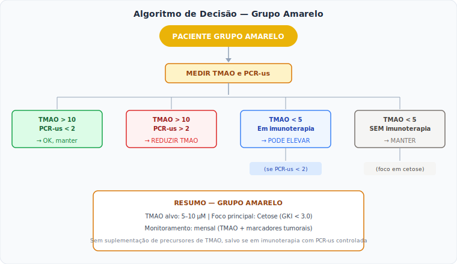

#### 🔴 GRUPO VERMELHO — TMAO Como Inimigo

**Cânceres incluídos:** Colorretal, Próstata, Hepatocarcinoma, Rim, Endométrio

**Evidência científica:**
- Múltiplos estudos associam TMAO elevado a pior prognóstico
- Colorretal: TMAO pode promover proliferação via ativação Wnt/β-catenina (Xu R et al., Frontiers in Oncology, 2022)
- Próstata: Correlação com progressão e agressividade (Frontiers in Pharmacology, 2024)
- Hepatocarcinoma: Agrava inflamação hepática pré-existente (Liu X et al., Cell Death & Disease, 2018)

**Protocolo para Grupo Vermelho:**

| Parâmetro | Alvo | Como Atingir |
|-----------|------|--------------|
| TMAO plasmático | < 5 μM | ZERO colina/carnitina suplementar |
| Proteína animal | Limitar | Priorizar proteína vegetal ou peixe branco |
| Foco principal | Cetose PROFUNDA | GKI < 1.0 |
| Butirato | ESSENCIAL | 2g 2x/dia (compensa ausência de TMAO) |

**Intervenções Específicas para Grupo Vermelho:**

| Câncer | Intervenção Adicional | Justificativa |
|--------|----------------------|---------------|
| Colorretal | Butirato 4g/dia + Aspirina 100mg | Butirato é HDAC-i, Aspirina reduz COX-2 |
| Próstata | Licopeno 30-50mg + Citrato K 2-4g | Licopeno é seletivo para próstata |
| Hepatocarcinoma | Silimarina 420mg + NAC 1200mg | Proteção hepática |
| Rim | Citrato de Potássio 3g + Hidratação | Alcalinização, proteção renal |
| Endométrio | DIM 300mg + Cálcio-D-Glucarato | Modulação estrogênica |

**⚠️ NOTA DE SEGURANÇA CITRATO DE POTÁSSIO (Grupo Vermelho):** Pacientes com insuficiência renal, idosos ou que usam diuréticos poupadores de potássio (ex: espironolactona) ou iECA/BRA (ex: losartana) **DEVEM** monitorar o Potássio sérico. Risco de arritmia cardíaca fatal se houver hipercalemia. O uso acima de 2g requer monitoramento dos níveis de potássio no sangue e função renal (Creatinina).

### 3.2 Cânceres Não Listados — Regra Default

**Para cânceres não listados acima (linfomas, leucemias, sarcomas, etc.):**

**Regra:** Tratar como **GRUPO AMARELO** até que evidência específica esteja disponível.

**Justificativa:** A estratificação TMAO foi desenvolvida principalmente para tumores sólidos. Cânceres hematológicos têm biologia distinta e os dados sobre TMAO são insuficientes.

**Nota especial para Leucemias/Linfomas:**
- Foco em: cetose moderada, butirato, micronutrientes
- TMAO: manter neutro (5-10 μM)
- Consultar oncologista hematológico antes de qualquer modulação

### 3.3 Protocolos Intensificados por Grupo

#### A. Suplementação Diferenciada

| Suplemento | Grupo Verde | Grupo Amarelo | Grupo Vermelho |
|------------|-------------|---------------|----------------|
| Colina | 500mg 2x/dia | — (ou 250mg/dia **apenas se em imunoterapia**) | **NÃO USAR** |
| L-Carnitina | 500-1000mg/dia | — (ou 250mg/dia **apenas se em imunoterapia**) | **NÃO USAR** |
| Citrato de Potássio | Opcional | 1g/dia | 2-4g/dia |
| Butirato | Opcional | 500mg/dia | **1-2g 2x/dia** |
| Licopeno | Opcional | Opcional | 30-50mg/dia (próstata) |
| Silimarina | Opcional | Opcional | 420mg/dia (fígado) |
| Sulforafano | Opcional | Opcional | 50-100mg/dia (colorretal) |

#### B. Metas Metabólicas por Grupo

| Parâmetro | Grupo Verde/Amarelo | Grupo Vermelho |
|-----------|---------------------|----------------|
| GKI (Glucose Ketone Index) | < 3.0 | **< 1.0** (crítico) |
| Carboidratos/dia | < 30g | **< 20g** |
| Jejum | 16:8 | **20:4 ou OMAD** |
| Cetonas sanguíneas | 0.5-3.0 mmol/L | **2.0-5.0 mmol/L** |

#### C. Monitoramento Específico para Grupo Vermelho

| Exame | Frequência | Alvo | Ação se Fora do Alvo |
|-------|------------|------|---------------------|
| TMAO plasmático | Quinzenal | < 5 μM | Reduzir proteína animal |
| PCR-us | Semanal | < 1 mg/L | Aumentar anti-inflamatórios |
| GKI | Diário | < 1.0 | Intensificar jejum |
| Marcadores específicos | Semanal | Tendência de queda | Ajustar protocolo |
| Potássio sérico | Quinzenal | 3.5-5.0 mEq/L | Ajustar Citrato de K |
| Função renal | Quinzenal | Creatinina normal | Avaliar suplementação |

### 3.4 Declaração de Compromisso com a Segurança

**A ESTRATIFICAÇÃO DO TMAO NÃO É OPCIONAL**

O Protocolo P8 exige que você determine seu GRUPO **ANTES** de implementar qualquer estratégia relacionada ao TMAO.

**Ignorar esta estratificação pode:**
- Acelerar progressão tumoral
- Anular benefícios do protocolo
- Colocar sua vida em risco

**Assine mentalmente este compromisso:**

"Eu entendo que o TMAO tem efeitos diferentes em diferentes cânceres. Eu identificarei meu GRUPO (Verde/Amarelo/Vermelho) e seguirei RIGOROSAMENTE o protocolo correspondente."

---


## Capítulo 4: O Metabolismo Como Arma — A Engenharia da Fome Seletiva

### 4.1 A Fome Seletiva (O Efeito Warburg Revisitado)

Células cancerígenas têm uma fraqueza estrutural e fatal: **a inflexibilidade metabólica**.

Enquanto uma célula saudável processa oxigênio de forma magistral através da fosforilação oxidativa nas mitocôndrias (gerando 36 moléculas de ATP por cada molécula de glicose), a célula tumoral recua para um mecanismo primitivo. Ela fermenta a glicose no citoplasma (gerando apenas 2 ATPs), mesmo quando há oxigênio abundante. A oncologia moderna sempre considerou isto um "defeito". Na verdade, é uma **estratégia de sobrevivência**.

A célula tumoral não quer apenas energia; ela precisa de biomassa. A fermentação rápida da glicose fornece os blocos de construção de carbono necessários para criar novas células, membranas e DNA. O tumor é, na sua essência, um reator químico viciado em glicose e glutamina.

**A nossa vantagem tática:** Se o tumor dependesse de oxigênio e gordura, não poderíamos matá-lo de fome sem matarmos o paciente. Mas, como ele é dependente de glicose, podemos explorar essa falha de segurança biológica cortando o seu suprimento primário.

### 4.2 A Dieta Cetogênica Como Terapia (A Troca de Combustível)

A dieta cetogênica oncológica não é uma dieta de emagrecimento; é uma intervenção metabólica de precisão. Quando reduzimos os carboidratos drasticamente (< 20g a 30g/dia), o fígado começa a transformar a gordura corporal em moléculas chamadas **corpos cetônicos** (principalmente o beta-hidroxibutirato, ou β-OHB).

O impacto dessa troca de combustível é duplo e devastador para a doença:

1. **Morte Tumoral por Inanição:** As mitocôndrias danificadas da célula cancerígena não possuem o maquinário enzimático necessário para usar corpos cetônicos como energia. O tumor literalmente "passa fome" num mar de energia que ele não consegue acessar.

2. **Reprogramação Epigenética:** Descobriu-se recentemente que o β-OHB não é apenas energia; é uma molécula sinalizadora. Ele atua como um inibidor natural de HDAC (histona deacetilase), "descompactando" o DNA das células saudáveis e religando genes de proteção antioxidante e longevidade que estavam silenciados.

**Resultado:** O tumor sofre asfixia metabólica, enquanto o corpo do paciente prospera com uma energia celular mais limpa e eficiente.

| O Que Acontece | Efeito no Tumor | Efeito nas Células Normais |
|----------------|-----------------|---------------------------|
| Glicose cai | Privação de combustível | Adaptação para cetonas |
| Cetonas sobem | Não consegue usar | Usa eficientemente |
| Insulina cai | Perde sinal de crescimento | Reparo e autofagia |
| IGF-1 cai | Perde fator de sobrevivência | Longevidade celular |
| Inflamação cai | Microambiente hostil | Ambiente saudável |

**O tumor sofre. O corpo prospera.**

### 4.3 O Jejum Potencializa (Resistência Diferencial ao Estresse)

Se a cetose corta o combustível, o Jejum Intermitente e o Jejum Prolongado (24h a 48h) ativam o que a ciência chama de **Resistência Diferencial ao Estresse (DSR)**.

Quando o paciente entra em jejum, as células saudáveis detectam a falta de nutrientes e entram imediatamente num modo de "hibernação celular" (autofagia e reparo). Elas fecham os seus escudos, bloqueiam a divisão celular e preparam-se para sobreviver.

As células do câncer, por outro lado, são impulsionadas por oncogenes mutados (como o mTOR ou o RAS) que funcionam como um acelerador travado no fundo. Elas não conseguem parar de tentar crescer, mesmo sem comida. Essa tentativa desesperada de se replicar num ambiente sem nutrientes causa um estresse oxidativo massivo dentro da célula tumoral.

É por isso que jejuar antes e após a quimioterapia é tão poderoso: a quimioterapia ataca as células tumorais (que estão vulneráveis e em curto-circuito metabólico), mas não consegue danificar as células saudáveis do paciente (que estão com os "escudos" da autofagia levantados). Os efeitos colaterais despencam e a letalidade contra o tumor aumenta.

Estudos mostram que jejum antes da quimioterapia:
- Reduz efeitos colaterais em 50-70%
- Mantém ou aumenta eficácia antitumoral
- Melhora qualidade de vida dramaticamente

### 4.4 A Combinação Metabólica

Não usamos apenas dieta. Combinamos:

| Intervenção | Mecanismo | Sinergia |
|-------------|-----------|----------|
| Cetogênica | Priva glicose | Base |
| Jejum | Depleta reservas | Amplifica |
| Metformina | Bloqueia complexo I mitocondrial | Adiciona via de bloqueio |
| Berberina | Similar à metformina | Reforça |
| 2-DG* | Inibe glicólise | Ataque direto |

*2-DG (2-deoxiglicose): Experimental, mencionar apenas

### 4.5 Bloqueio da "Porta dos Fundos": Inibição da Glutaminólise

**O Problema:** Quando bloqueamos a glicose (porta da frente), tumores agressivos — especialmente os impulsionados pelo oncogene *MYC* — mudam para consumir **Glutamina** (porta dos fundos). Se não bloquearmos a glutamina, a cetose pode perder eficácia.

**A Solução: O "Coquetel Anti-Glutamina"**

Não podemos zerar a glutamina (o intestino e o sistema imune precisam dela), mas podemos dificultar seu uso pelo tumor através de inibidores naturais.

**Protocolo Anti-Glutamina (Pulsar 3-4 dias na semana):**

| Composto | Mecanismo | Dose | Timing |
|----------|-----------|------|--------|
| **EGCG (Chá Verde)** | Inibe glutamato desidrogenase (GDH) | 400-600mg (padronizado 50% EGCG) | Manhã, com refeição leve (NUNCA em jejum) |
| **Resveratrol** | Reduz absorção de glutamina | 500mg | Com refeição gordurosa |
| **L-Teanina** | Análogo estrutural, compete por transportadores | 200-400mg | Manhã |
| **Curcumina** | Inibe glutaminase | 1-1.5g (lipossomal) | Com refeição |

**⚠️ NOTA DE SEGURANÇA EGCG:** Doses acima de 600mg podem causar hepatotoxicidade em pessoas suscetíveis. Manter no máximo 600mg/dia; usar 800mg apenas sob monitoramento de enzimas hepáticas (TGO/TGP).

**⚠️ ORIENTAÇÃO ADICIONAL PARA EGCG:** Para minimizar risco de hepatotoxicidade, tome EGCG **SEMPRE com alimentos** (nunca em jejum prolongado) e prefira **dividir a dose em 2 tomadas** (ex: 200-300mg + 200-300mg) em vez de dose única. Estudos mostram que dose em bolus em jejum aumenta significativamente o risco de lesão hepática [Hu et al., 2018].

**⚠️ NOTA DE SEGURANÇA PROTOCOLO ANTI-GLUTAMINA:** Este protocolo é baseado em mecanismos pré-clínicos e extrapolação de dados. As doses e combinações não foram validadas em ensaios clínicos. Recomenda-se iniciar com doses mais baixas e aumentar gradualmente, monitorando função hepática (para EGCG) e tolerância gastrointestinal.

**Justificativa científica:**
- Tumores MYC-driven são altamente dependentes de glutamina
- A combinação de privação de glicose + restrição de glutamina cria um "cerco metabólico"
- Estudos pré-clínicos mostram sinergia entre cetose e inibição de glutaminólise

**Referências para Glutaminólise:**
- Jin L, et al. Glutaminase inhibitors induce thiol-mediated oxidative stress. *J Clin Invest*. 2020.
- Wang H, et al. The metabolic trap: Glutamine deprivation induces metabolic reprogramming. *Neoplasia*. 2018.
- Wise DR, Thompson CB. Glutamine addiction: a new therapeutic target in cancer. *Trends Biochem Sci*. 2010.

**⚠️ IMPORTANTE:** Este protocolo é PULSADO (não contínuo) para preservar a função intestinal e imune, que também dependem de glutamina.

### 4.6 Proteção Muscular Durante a Cetose — Protocolo Anti-Sarcopenia

**⚠️ ATENÇÃO:** A perda muscular (sarcopenia) é um preditor independente de mortalidade em câncer. Proteger o músculo é TÃO importante quanto atacar o tumor.

#### Sinais de Alerta para Sarcopenia:
- Perda de peso não intencional > 5% em 3 meses
- Fraqueza progressiva
- Dificuldade em subir escadas
- Circunferência de panturrilha < 31 cm
- Força de preensão reduzida

#### Protocolo de Proteção Muscular:

| Intervenção | Dose | Timing |
|-------------|------|--------|
| Proteína | 1.5-2.0 g/kg/dia | Distribuída em 3-4 refeições |
| EAAs (aminoácidos essenciais) | 10-15g/dia | Pós-exercício ou entre refeições |
| HMB (β-hidroxi β-metilbutirato) | 3g/dia | Dividido em 3 doses |
| Leucina extra | 3-5g/dose | A cada refeição proteica |
| Creatina | 5g/dia | Qualquer horário |
| Vitamina D | 10.000 UI | Manhã |
| Exercício resistido | 3x/semana | Adaptado à capacidade |

**⚠️ NOTA SOBRE LEUCINA E mTOR:** A ativação de mTOR via Leucina neste protocolo visa exclusivamente a síntese proteica muscular para combater a sarcopenia, devendo ser administrada de forma pulsada (com as refeições proteicas) e preferencialmente associada a estímulo mecânico (exercício resistido). A ativação de mTOR neste contexto é localizada e temporária, diferente da ativação sistêmica crônica de mTOR que favorece o crescimento tumoral.

#### Protocolo de Emergência para Sarcopenia Ativa:

Se houver perda muscular ativa durante cetose:

1. **Aumentar EAAs para 20g/dia** (em doses divididas)
2. **Adicionar HMB 3g 2x/dia**
3. **Considerar pausa temporária da cetose** (2-4 semanas) com dieta hipercalórica rica em proteína
4. **Reavaliar com bioimpedância semanal**
5. **Fisioterapia oncológica especializada**

**Nota para Grupo Vermelho com Sarcopenia:** Pacientes do Grupo Vermelho que desenvolvem sarcopenia devem priorizar temporariamente a preservação muscular. GKI < 1.5 (em vez de < 1.0) é aceitável durante a recuperação muscular.

---


## Capítulo 5: O Tempo Como Terapia — A Cronobiologia Oncológica

### 5.1 Ritmos Circadianos e Câncer (A Quebra do Relógio)

Cada célula do seu corpo não sabe apenas *o que* fazer; ela sabe *quando* fazer. O Núcleo Supraquiasmático no seu cérebro age como um maestro, utilizando a luz do sol e a escuridão para sincronizar os relógios periféricos de todos os seus órgãos através de genes específicos (como o *CLOCK* e o *BMAL1*).

O metabolismo é regido pelo tempo:
- Quando reparar DNA (noite)
- Quando dividir células (manhã)
- Quando metabolizar nutrientes (dia)
- Quando desintoxicar (madrugada)

**A estratégia do tumor:** Uma das primeiras coisas que um câncer agressivo faz é silenciar ou destruir os seus próprios "genes-relógio". Ao fazer isso, a célula tumoral desobriga-se de dormir. Ela passa a dividir-se 24 horas por dia, ignorando os ritmos de descanso do corpo. 

**Células cancerígenas frequentemente têm relógios quebrados.** Isso as torna vulneráveis.

Restabelecer o ritmo circadiano do paciente através do sono absoluto, exposição solar matinal e jejum noturno é uma forma de forçar o tumor a voltar para um ambiente sistêmico regrado, inibindo o seu crescimento caótico.

### 5.2 Cronoterapia (O Timing da Toxicidade)

Se o corpo metaboliza toxinas de forma diferente ao longo do dia, administrar um tratamento na hora errada é um erro clínico. A Cronoterapia é a ciência de administrar o medicamento oncológico no exato momento em que as células do paciente estão mais protegidas e as células do tumor estão mais ativas e vulneráveis.

Ensaios clínicos extensos já demonstraram que administrar quimioterápicos (como o 5-Fluorouracil ou a Oxaliplatina) no horário ideal ditado pelos ritmos circadianos pode **reduzir a toxicidade severa em até 50%**, permitindo doses mais eficazes e melhorando a taxa de resposta do tumor. O tempo não é um detalhe acessório da terapia; o tempo *é* a terapia.

Timing não é detalhe — é terapia:

| Intervenção | Melhor Horário | Justificativa |
|-------------|----------------|---------------|
| Quimioterapia | Varia por droga | 5-FU: noite; Platinas: manhã |
| Jejum | Noturno (16h-8h) | Alinha com ritmo de reparo |
| Exercício | Manhã/tarde | Amplitude circadiana |
| Suplementos | Contexto-específico | Ver tabela abaixo |
| Luz solar | Manhã | Sincroniza relógio mestre |
| Melatonina | 22h | Suporte circadiano + antitumoral |

### 5.3 Protocolo Circadiano Completo

**MANHÃ (6h-12h):**
- Exposição à luz solar 20-30 min
- Exercício se possível
- Metformina (com café da manhã cetogênico)
- Vitamina D, Vitamina K2
- Café/chá verde (EGCG)

**TARDE (12h-18h):**
- Refeição principal cetogênica
- Curcumina + piperina (com gordura)
- Berberina (antes da refeição)
- Ômega-3 (com refeição)

**NOITE (18h-22h):**
- Última refeição leve ou início do jejum
- Reduzir luz artificial
- Magnésio
- Ashwagandha (se estresse)

**ANTES DE DORMIR (22h):**
- Melatonina 3-5mg (início), podendo chegar a 10mg se tolerado
- Ambiente escuro e fresco
- Evitar telas 1h antes

### 5.4 O Nervo Vago e a Imunidade: A Via Neural

**A Anatomia do Estresse:** Quando o paciente recebe o diagnóstico de câncer, ele entra em um estado de "luta ou fuga" contínuo. Esse estresse crônico mantém o Sistema Nervoso Simpático hiperativo, inundando o corpo com adrenalina e cortisol. O cortisol elevado crônico não apenas eleva o açúcar no sangue (alimentando o tumor), mas suprime ativamente as células NK (Natural Killers) — a principal cavalaria do sistema imunológico. O estresse é, quimicamente, o adubo do câncer.

**A Solução Científica (O Reflexo Inflamatório):** Nas últimas décadas, neuroimunologistas descobriram a *Via Colinérgica Anti-inflamatória*. O **Nervo Vago** (o principal nervo do sistema parassimpático, que desce do cérebro até o abdômen) funciona como um interruptor mestre de inflamação.

Quando ativamos o Nervo Vago através de exercícios respiratórios profundos, exposição ao frio ou até pelo ato de cantarolar, as suas terminações nervosas liberam um neurotransmissor chamado **Acetilcolina**. Esta substância liga-se diretamente aos receptores dos macrófagos (as nossas células de defesa), enviando um comando elétrico que desliga imediatamente a produção de citocinas inflamatórias (inibindo a via do NF-κB).

Estimular o nervo vago não é apenas uma prática de relaxamento; é **imunomodulação neuroquímica**. Estudos oncológicos recentes mostram uma correlação direta entre um tônus vagal elevado (medido pela variabilidade da frequência cardíaca) e um prognóstico drasticamente melhor, simplesmente porque a inflamação sistêmica que alimenta o microambiente tumoral é continuamente "desligada" pelo cérebro.

**Protocolo de Ativação Vagal (Obrigatório 2x/dia):**

| Técnica | Como Fazer | Duração | Mecanismo |
|---------|------------|---------|-----------|
| **Respiração 4-7-8** | Inspirar 4s, segurar 7s, expirar 8s | 6 ciclos (3 min) | Ativa parassimpático via expiração prolongada |
| **Exposição ao Frio (Rosto)** | Mergulhar rosto em água gelada (10-15°C) | 30 segundos | Ativa "reflexo de mergulho" — resposta vagal potente |
| **Cantarolar (Humming)** | Fazer som "hmmm" grave e prolongado | 5 minutos | Vibração das cordas vocais estimula vago |
| **Gargarejo Vigoroso** | Gargarejar água vigorosamente | 30-60 segundos | Estimula ramo faríngeo do vago |
| **Massagem do Tragus** | Massagear a cartilagem da orelha (tragus) | 2 minutos | Ramo auricular do vago |

**Protocolo Integrado:**

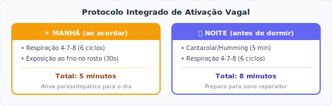

**Evidência:** A estimulação vagal está sendo estudada em ensaios clínicos como adjuvante em oncologia, com resultados preliminares promissores em redução de fadiga e melhora da qualidade de vida.

---

## Capítulo 6: A Sinergia do Protocolo P8

### 6.1 A Falácia da "Bala de Prata" e as Vias de Escape

A maior falha da medicina no último século foi a busca pela "bala de prata" — uma única droga mágica para matar o câncer. Isso falhou porque os tumores são mestres da **redundância biológica**.

O câncer funciona como um rio fluindo por uma montanha. Se você constrói uma represa para bloquear a água (ex: usa uma droga para bloquear uma mutação específica), a água simplesmente acumula, encontra uma rachadura lateral e cria um novo caminho (Via de Escape). Se bloqueamos a glicose, ele busca a glutamina. Se usamos quimioterapia, ele aumenta os antioxidantes intracelulares para sobreviver.

A Sinergia do Protocolo P8 não é apenas tomar várias coisas ao mesmo tempo. É um **cerco tático calculado**. Nós não construímos apenas uma represa; nós bloqueamos o rio, secamos a fonte e fechamos as rotas de fuga laterais, tudo simultaneamente.

### 6.2 A Matemática do Cerco Metabólico (O Efeito Multiplicador)

A biologia não funciona por soma; ela funciona por exponenciação. Quando combinamos terapias racionais, 1 + 1 não é igual a 2. Pode ser igual a 10.

Por exemplo, usar a Dieta Cetogênica isoladamente reduz o crescimento tumoral. Usar o inibidor do EGCG (Chá Verde) isoladamente tem um efeito brando. Mas quando o tumor, desesperado pela falta de glicose (Dieta Cetogênica), tenta abrir a porta de emergência da glutamina e encontra essa porta trancada pelo EGCG, a célula entra em colapso apoptótico (morte celular programada). O efeito combinado é letal.

| Combinação | Efeito Individual | Efeito Combinado |
|------------|-------------------|------------------|
| Cetogênica + Metformina | Moderado cada | Bloqueio metabólico total |
| TMAO + Anti-PD-1* | 15% vs 30% | **85%** |
| Jejum + Quimioterapia | Proteção + Eficácia | Toxicidade ↓70%, Eficácia ↑ |
| Cronoterapia + Qualquer | Base | Otimização de tudo |
| Cetose + Imunoterapia | Independentes | Sinergia comprovada (2025) |
| Cetose + Anti-Glutamina | Parcial cada | Cerco metabólico completo |

*Apenas para cânceres do GRUPO VERDE

### 6.3 Cetose e Imunoterapia: A Sinergia Confirmada

Ensaios clínicos de 2024-2025 confirmaram que a dieta cetogênica **durante** a imunoterapia:

1. **Não atrapalha** — pelo contrário, potencializa a resposta imune
2. **Reduz toxicidade** — pacientes toleram melhor os inibidores de checkpoint
3. **Melhora resposta** — maior taxa de resposta completa
4. **Mecanismo** — cetonas são usadas preferencialmente por células T, aumentando sua eficiência

**Nota sobre evidência:** Estudos 2024-2025 mostram sinergia promissora, mas ainda carecem de RCTs em larga escala. A plausibilidade biológica é forte.

**Este é um argumento científico forte para convencer oncologistas relutantes.**

### 6.4 ⚠️ Risco de Metástase com Cetose Profunda — Atenção Especial

**Estudo Columbia 2024 (Science Advances — Su Z et al.):** Em modelo de mama (inclui TNBC), dieta cetogênica reduziu tumor primário mas **aumentou metástases pulmonares** via BACH1 (glucose starvation → ATF4 → BACH1 ativa genes pró-metastáticos).

**Referência:** DOI: 10.1126/sciadv.adm9481

### 6.5 ⚠️ PROTOCOLO ESCUDO BACH1 — OBRIGATÓRIO PARA CÂNCER DE MAMA

**O Problema Identificado:**

Em cânceres de mama (especialmente TNBC), a privação de glicose (cetose) pode ativar a proteína **BACH1** através da via:


BACH1 usa antioxidantes endógenos para proteger a célula tumoral e facilitar migração (metástase), mesmo enquanto o tumor primário diminui.

**A Solução (O "Escudo"):**

O mesmo estudo demonstrou que antioxidantes específicos contrabalançam esse efeito, quebrando a via BACH1.

**REGRA DE SEGURANÇA BACH1:**

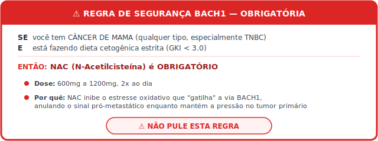

**Protocolo Completo para Câncer de Mama em Cetose:**

| Componente | Dose | Timing | Função |
|------------|------|--------|--------|
| **NAC** | 600-1200mg 2x/dia | Manhã e noite | Bloqueador BACH1 (OBRIGATÓRIO) |
| **Vitamina E (tocoferóis mistos)** | 400-800 UI | Com refeição | Antioxidante lipofílico |
| **Selênio** | 200mcg | Manhã | Cofator glutationa |
| **Sulforafano** | 50-100mg | Manhã | Indutor Nrf2 |

**Nota sobre a base científica do Protocolo BACH1:** A inclusão do NAC como modulador da via BACH1 baseia-se na plausibilidade biológica da regulação do estresse oxidativo descrita por Su Z et al. (2024, *Science Advances*). O estudo demonstrou em modelos murinos que a inibição genética ou farmacológica de BACH1 abolia completamente as metástases induzidas pela dieta cetogênica. O NAC, como precursor de glutationa, atua na modulação do estresse oxidativo que ativa a via ATF4→BACH1. Estudos clínicos confirmatórios em humanos são necessários.

**Monitoramento Adicional para Mama em Cetose:**

- Imagem mais frequente nos primeiros 3 meses (verificar metástases)
- Limitar cetose muito profunda (GKI < 1.0) a períodos curtos
- Se houver suspeita de progressão metastática, reavaliar estratégia

**RECOMENDAÇÃO para GRUPO VERDE (mama) com risco metastático:**
- NAC obrigatório durante toda a cetose
- Monitoramento de imagem mais frequente nos primeiros 3 meses
- Limitar elevação intensa de TMAO a 8-12 semanas; depois descida gradual
- Pesar benefício vs. risco em pacientes com doença metastática ativa

### 6.6 Por Que a Oncologia Convencional Não Faz Isso?

1. **Não é patenteável** — não há incentivo financeiro
2. **É complexo demais** — requer mudança de paradigma
3. **Ameaça o status quo** — bilhões investidos no modelo atual
4. **Requer participação do paciente** — o sistema prefere pacientes passivos
5. **Cruza especialidades** — nutrição, cronobiologia, imunologia, biofísica

**Mas nada disso significa que não funciona. Significa apenas que o sistema não quer implementar.**

---


## Capítulo 7: O Modelo P8 — A Arquitetura da Remissão

O nome "Protocolo P8" não é um acrônimo de marketing. Ele deriva da evolução do conceito clássico da "Medicina 4P" (desenvolvido pelo biólogo Leroy Hood), expandido aqui para **oito dimensões terapêuticas**.

Para que a reprogramação metabólica e microbiana funcione, ela não pode ser aplicada de forma linear. O câncer é um sistema complexo e adaptativo; portanto, a nossa resposta precisa ser um sistema igualmente complexo e estruturado. Estes são os oito pilares que sustentam o cerco total à doença:

**P1 — PERSONALIZADA (A Individualidade Bioquímica)**

O modelo oncológico tradicional trata o "câncer de mama" ou o "câncer de cólon" como se fossem entidades idênticas em todos os seres humanos. O Pilar 1 estabelece que o tratamento deve focar no *hospedeiro*. A genética tumoral importa, mas a sua tolerância à glicose, a composição exata do seu microbioma intestinal e a sua capacidade de metilação hepática ditam a regra. É por isso que o Protocolo P8 não impõe uma regra única, mas exige a estratificação (como o Sistema Semáforo do TMAO) antes de qualquer intervenção.

**P2 — PREDITIVA (A Antecipação do Movimento)**

Células cancerígenas sofrem mutações rápidas para escapar de terapias. Se esperarmos meses por uma nova tomografia para descobrir se o tratamento falhou, perderemos a guerra. A medicina preditiva utiliza biomarcadores em tempo real. Ao monitorarmos diariamente o GKI (Índice Glicose-Cetona) e quinzenalmente marcadores inflamatórios silentes (como a PCR-ultrassensível e a Homocisteína), conseguimos antecipar se o microambiente está se tornando pró-tumor ou anti-tumor, ajustando a rota semanas antes de o tumor ter a chance de crescer fisicamente.

**P3 — PREVENTIVA (A Modificação do Terreno)**

A oncologia clássica foca em matar a célula tumoral existente. O Pilar 3 atua no "terreno biológico" (o microambiente). Células-tronco cancerígenas (Cancer Stem Cells) — as verdadeiras responsáveis pelas metástases e recidivas — só conseguem prosperar em terrenos ácidos, inflamados e hipóxicos. Ao utilizarmos o jejum intermitente e compostos como a Curcumina e o EGCG, nós prevenimos a expansão clonal alterando a química do tecido ao redor do tumor, tornando o corpo um ambiente inóspito para a sobrevivência do câncer.

**P4 — PARTICIPATIVA (O Fim da Passividade)**

Historicamente, o paciente oncológico é tratado como um objeto passivo que "recebe" a terapia. O Protocolo P8 exige o fim dessa passividade. O paciente torna-se o gestor diário do seu metabolismo. Medir as próprias cetonas, aplicar técnicas de respiração para controle do tônus vagal e organizar o timing das refeições devolvem o controle (e a responsabilidade) ao indivíduo. A ciência demonstra que o senso de agência e controle reduz o cortisol basal, impactando diretamente a sobrevida.

**P5 — PERIÓDICA (A Cronobiologia Oncológica)**

O tempo é uma droga potente. O Pilar 5 reconhece que a eficácia e a toxicidade de qualquer intervenção mudam drasticamente dependendo do ritmo circadiano. Administrar o estresse oxidativo ou privação de nutrientes quando a célula tumoral está na sua fase de replicação máxima cria danos letais. Simultaneamente, alimentar e proteger as células saudáveis durante a sua fase de reparo noturno é o que permite ao corpo suportar a toxicidade dos tratamentos sem entrar em falência. Timing não é um detalhe; é a espinha dorsal do método.

**P6 — POSBIÓTICA (A Engenharia Microbiana)**

O uso de probióticos (bactérias vivas) já é conhecido, mas o Protocolo P8 avança para a era dos *Pós-bióticos* — os subprodutos químicos que essas bactérias fabricam. Não estamos apenas tentando melhorar a digestão; estamos usando a flora intestinal como uma "fábrica farmacêutica" interna. Ao fornecermos o substrato correto (fibras para gerar Butirato, ou colina/carnitina para gerar TMAO no Grupo Verde), forçamos as bactérias a sintetizarem moléculas que viajam até o tumor e desativam o "escudo" invisível que o protege do sistema imunológico.

**P7 — PRECISA (O Alvo Metabólico)**

A quimioterapia tradicional assemelha-se a um bombardeio em área: destrói a cidade para eliminar o inimigo. A abordagem do P8 atua como franco-atiradores. Usamos a Metformina para bloquear o Complexo I da mitocôndria tumoral. Usamos inibidores naturais (como o Chá Verde e a L-Teanina) para fechar a porta lateral da glutaminólise. E usamos o Protocolo BACH1 (NAC) de forma cirúrgica para impedir que a célula do câncer de mama ative genes metastáticos ao passar fome. É pressão metabólica pura, aplicada nos pontos de estrangulamento exatos do tumor.

**P8 — PROCESSADA (A Integração de Dados)**

Nenhum cérebro humano consegue calcular, isoladamente, as dezoito variáveis diárias de sono, glicose, marcadores tumorais e dosagens de suplementos. O oitavo pilar representa a era da informação. O paciente P8 processa os seus dados, cruza as interações e utiliza a tecnologia (como o registro diário de GKI, a análise de variabilidade da frequência cardíaca em *smartwatches*, e a busca por literatura médica atualizada via inteligência artificial) para manter o protocolo rigorosamente ajustado à sua evolução clínica real.

*TMAO apenas para GRUPO VERDE — ver Capítulo 3

---

# PARTE II: IMPLEMENTAÇÃO SEGURA

## Capítulo 8: Contraindicações e Precauções

### ⚠️ LEIA ESTE CAPÍTULO ANTES DE INICIAR O PROTOCOLO

Este capítulo foi posicionado no início da Parte II propositalmente. Antes de implementar qualquer intervenção, você DEVE verificar se há contraindicações que se aplicam ao seu caso.

### 8.1 Contraindicações Absolutas ao Protocolo Cetogênico

| Condição | Por Quê | Alternativa |
|----------|---------|-------------|
| Deficiência de piruvato carboxilase | Incapacidade de gliconeogênese | Dieta low-carb moderada |
| Deficiência de carnitina primária | Não metaboliza gordura | Suplementar carnitina + low-carb |
| Porfiria aguda | Cetose pode precipitar crises | Evitar cetose estrita |
| Gravidez/Lactação | Segurança não estabelecida | Low-carb moderado se necessário |
| Diabetes tipo 1 descompensado | Risco de cetoacidose | Controle glicêmico primeiro |
| Insuficiência hepática grave | Não metaboliza cetonas adequadamente | Protocolo modificado |
| Insuficiência renal grave (TFG < 30) | Sobrecarga proteica e cetônica | Adaptar com nefrologista |
| Transtornos alimentares ativos | Pode exacerbar comportamentos | Suporte psicológico primeiro |

### 8.2 Precauções Especiais

| Situação | Precaução |
|----------|-----------|
| Uso de insulina | Ajustar doses (risco de hipoglicemia) |
| Uso de anticoagulantes | Monitorar INR (vitamina K pode interferir) |
| Uso de lítio | Monitorar níveis (cetose altera excreção) |
| Histórico de cálculos renais | Hidratar bem, citrato de potássio |
| Histórico de gota | Monitorar ácido úrico |
| Idosos frágeis | Priorizar proteção muscular |
| Crianças | Apenas sob supervisão especializada |

### 8.3 Interações Medicamentosas Importantes

| Medicamento | Interação com Protocolo | Manejo |
|-------------|------------------------|--------|
| Metformina | Sinergia (desejável), mas risco de acidose se jejum muito prolongado | Evitar jejum >24h |
| Insulina/Sulfonilureias | Hipoglicemia | Reduzir doses, monitorar |
| Varfarina | Vitamina K altera INR | Monitorar INR semanalmente |
| Quimioterápicos | Jejum pode alterar farmacocinética | Coordenar com oncologista |
| Corticoides | Antagonizam cetose (elevam glicose) | Minimizar uso se possível |
| Anticonvulsivantes | Podem ser reduzidos em cetose | Ajustar com neurologista |

### 8.4 Contraindicações Específicas por Intervenção

#### Vitamina C Intravenosa
**⚠️ CONTRAINDICAÇÃO ABSOLUTA (G6PD):** O exame de sangue para "Deficiência de G6PD" (Glicose-6-Fosfato Desidrogenase) é **OBRIGATÓRIO** antes da primeira infusão. Pacientes com essa deficiência genética não conseguem metabolizar o estresse oxidativo gerado por altas doses de Vitamina C e correm risco de hemólise grave (destruição severa dos glóbulos vermelhos).

#### DCA (Dicloroacetato)
**⚠️ CONTRAINDICAÇÕES ABSOLUTAS:**
- Neuropatia pré-existente
- Doença hepática
- Deficiência de tiamina
- Uso de metformina em dose alta (risco de acidose láctica)

#### Artemisinina/Ferroptose
**⚠️ CONTRAINDICAÇÕES:**
- Gravidez
- Anemia severa
- Deficiência de G6PD
- Hemocromatose ou sobrecarga de ferro

#### EGCG (Extrato de Chá Verde)
**⚠️ PRECAUÇÃO:** Doses acima de 600mg podem causar hepatotoxicidade. Monitorar enzimas hepáticas (TGO/TGP).

#### Citrato de Potássio
**⚠️ PRECAUÇÃO:** Pacientes com insuficiência renal, idosos ou que usam diuréticos poupadores de potássio (ex: espironolactona) ou iECA/BRA (ex: losartana) **DEVEM** monitorar o Potássio sérico.

#### Probióticos
**⚠️ ALERTA DE NEUTROPENIA:** Se você estiver em quimioterapia e seus leucócitos/neutrófilos estiverem criticamente baixos (neutropenia), **SUSPENDA** os probióticos temporariamente até a recuperação da medula.

### 8.5 Checklist de Segurança Pré-Protocolo

Antes de iniciar, confirme:

- [ ] Identifiquei meu GRUPO (Verde/Amarelo/Vermelho) no Capítulo 3
- [ ] Não tenho nenhuma contraindicação absoluta listada acima
- [ ] Informei meu oncologista sobre minha intenção de seguir o protocolo
- [ ] Tenho acesso a exames laboratoriais regulares
- [ ] Verifiquei interações com meus medicamentos atuais
- [ ] Se tenho câncer de mama, entendi a obrigatoriedade do NAC (Protocolo BACH1)
- [ ] Se sou do Grupo Vermelho, entendi que NÃO devo suplementar Colina/Carnitina

**Só prossiga para o Capítulo 9 após completar este checklist.**

---


## Capítulo 9: Protocolo Completo — Passo a Passo

### 9.1 AVALIAÇÃO INICIAL

**Antes de começar, precisamos saber onde estamos.**

#### Exames Obrigatórios:

| Categoria | Exames | Por Quê |
|-----------|--------|---------|
| **Metabólicos** | Glicemia jejum, HbA1c, Insulina, HOMA-IR | Estado metabólico basal |
| **Inflamatórios** | PCR-us, Ferritina, Homocisteína | Nível inflamatório |
| **Tumorais** | Marcadores específicos do câncer | Baseline para acompanhamento |
| **Microbiota** | TMAO plasmático (se disponível) | Estratificação do protocolo |
| **Nutricionais** | Vitamina D, B12, Zinco, Magnésio | Deficiências a corrigir |
| **Hepáticos/Renais** | TGO, TGP, Creatinina, Ureia | Segurança para suplementação |
| **Composição Corporal** | Bioimpedância ou DEXA | Massa muscular basal |

#### Questionários:

1. **Histórico alimentar** — o que come habitualmente?
2. **Padrão de sono** — qualidade, duração, horários
3. **Nível de atividade física** — capacidade atual
4. **Suporte social** — quem vai ajudar?
5. **Medicamentos em uso** — interações potenciais
6. **Sintomas atuais** — dor, fadiga, náusea, etc.

### 9.2 DETERMINAÇÃO DO GRUPO (Verde/Amarelo/Vermelho)

**Este passo é OBRIGATÓRIO antes de qualquer intervenção relacionada ao TMAO.**

Consulte a Tabela 1 (Capítulo 3) e determine:

- [ ] Meu câncer está no GRUPO VERDE → Posso elevar TMAO
- [ ] Meu câncer está no GRUPO AMARELO → TMAO neutro, foco em cetose
- [ ] Meu câncer está no GRUPO VERMELHO → Devo SUPRIMIR TMAO
- [ ] Meu câncer não está listado → Tratar como GRUPO AMARELO

### 9.3 FASE 1: PREPARAÇÃO (Semanas 1-4)

**Objetivo:** Preparar o corpo para as intervenções principais.

#### A. Dieta de Transição

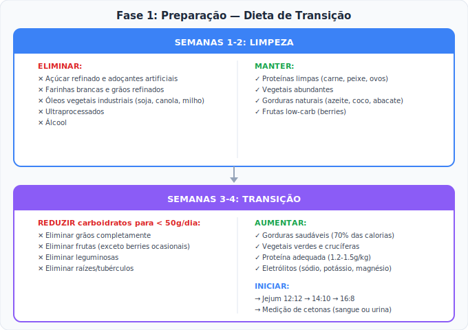

#### ⚠️ IMPORTANTE: O QUE ESPERAR NAS PRIMEIRAS SEMANAS ("KETO FLU")

Nas primeiras 1-3 semanas de transição para a cetose, é **comum e esperado** que você experimente alguns sintomas desconfortáveis. Isso NÃO significa que o protocolo está falhando — pelo contrário, indica que seu metabolismo está mudando de combustível. Esses sintomas são temporários e geralmente desaparecem em 7-14 dias.

**Sintomas Comuns e Soluções:**

| Sintoma | Causa | Solução | Duração Típica |
|---------|-------|---------|----------------|
| **Fadiga/Fraqueza** | Corpo ainda não adaptado às cetonas | Aguardar adaptação; descansar mais | 5-14 dias |
| **Dor de cabeça** | Perda de sódio e desidratação | Aumentar sal (3-5g/dia); hidratar bem | 3-7 dias |
| **Cãibras musculares** | Depleção de eletrólitos | Magnésio 400mg + Potássio 1-2g/dia | 3-10 dias |
| **Constipação** | Mudança de fibras e hidratação | Vegetais verdes; magnésio; água | 7-14 dias |
| **Irritabilidade** | Queda de glicose; abstinência de açúcar | Normal; melhora com adaptação | 5-10 dias |
| **Tontura ao levantar** | Pressão arterial mais baixa | Levantar devagar; sal; hidratação | 7-14 dias |
| **Mau hálito (metálico)** | Acetona sendo exalada | Temporário; sinal de cetose | Variável |

**O que fazer:**
1. **NÃO DESISTA** — esses sintomas são temporários e indicam que a transição está funcionando
2. **Aumente o sal** — adicione 3-5g de sal extra por dia (caldo de osso é excelente)
3. **Hidrate-se** — beba pelo menos 2-3 litros de água por dia
4. **Suplemente eletrólitos** — Magnésio, Potássio e Sódio são essenciais
5. **Descanse mais** — seu corpo está se reconfigurando

**Quando procurar ajuda médica:**
- Sintomas persistindo além de 3 semanas
- Vômitos incontroláveis
- Confusão mental severa
- Palpitações frequentes ou arritmia

#### B. Suplementação Base — Fase Preparatória

**SUPLEMENTAÇÃO UNIVERSAL (Todos os Grupos)**

| Suplemento | Dose | Horário | Função |
|------------|------|---------|--------|
| **Vitamina D3** | 10.000 UI | Manhã com gordura | Imunomodulação, anticâncer |
| **Vitamina K2 (MK-7)** | 200 mcg | Com D3 | Direciona cálcio |
| **Ômega-3 (EPA/DHA)** | 3-4g | Com refeições | Anti-inflamatório |
| **Magnésio glicinato** | 400-600mg | Noite | Sono, enzimas, relaxamento |
| **Complexo B metilado** | Padrão "B-50" ou equivalente (B1/B2/B6 ~50mg, B12 ~500mcg, B9 como Metilfolato) | Manhã | Energia, metilação |
| **Probiótico multi-cepa** | 50-100 bilhões UFC | Jejum, manhã | Microbioma |
| **Vitamina C** | 2-3g | Dividida | Imunidade, colágeno |
| **NAC** | 600mg 2x | Manhã e noite | Glutationa, detox |
| **CoQ10 (ubiquinol)** | 200-400mg | Manhã com gordura | Função mitocondrial |

**⚠️ NOTA DE SEGURANÇA VITAMINA D:** Doses acima de 10.000 UI exigem monitoramento dos níveis de Cálcio Sérico e PTH (Paratormônio) a cada 3 meses para evitar hipercalcemia.

**⚠️ ALERTA DE NEUTROPENIA (Probióticos):** Se você estiver em quimioterapia e seus leucócitos/neutrófilos estiverem criticamente baixos (neutropenia), **SUSPENDA** os probióticos temporariamente até a recuperação da medula. Discuta com seu oncologista. Iniciar com doses menores (30-50 bilhões UFC) e aumentar gradualmente.

**SUPLEMENTAÇÃO ESPECÍFICA POR GRUPO — Fase Preparatória**

| Suplemento | GRUPO VERDE | GRUPO AMARELO | GRUPO VERMELHO |
|------------|-------------|---------------|----------------|
| **Colina** | 500mg/dia | — | **NÃO USAR** |
| **L-carnitina** | 500mg/dia | — | **NÃO USAR** |
| **Citrato de Potássio** | — | 1g/dia | 2g/dia |
| **Butirato** | — | 500mg/dia | 1g/dia |

**PROTEÇÃO MUSCULAR (Todos os Grupos)**

| Suplemento | Dose | Horário | Função |
|------------|------|---------|--------|
| **Aminoácidos Essenciais (EAAs)** | 10-15g/dia | Pré/pós-exercício | Síntese muscular |
| **Creatina** | 5g/dia | Qualquer | Força e massa muscular |
| **HMB** | 3g/dia | Dividido | Anti-catabólico |
| **Leucina** | 3-5g/dia | Com refeições | Ativação mTOR |

### 9.4 FASE 2: CETOSE E JEJUM (Semanas 5-12)

**Objetivo:** Estabelecer cetose nutricional consistente e rotina de jejum.

#### A. Dieta Cetogênica Oncológica

**MACROS DIÁRIOS:**
- **Carboidratos:** < 20-30g (Grupo Verde/Amarelo) ou < 20g (Grupo Vermelho)
- **Proteína:** 1.2-2.0 g/kg peso corporal ideal
- **Gordura:** Restante das calorias (60-75%)
- **Calorias:** Déficit leve (10-15%) ou manutenção, NUNCA excesso

**ALIMENTOS PERMITIDOS:**

| Categoria | Exemplos | Notas |
|-----------|----------|-------|
| **Proteínas** | Carne (bovina, suína), aves, peixe, ovos, frutos do mar | Grupo Vermelho: limitar carne vermelha |
| **Gorduras** | Azeite extra-virgem, óleo de coco, manteiga/ghee, abacate | Evitar óleos vegetais refinados |
| **Vegetais** | Folhas verdes, crucíferas, abobrinha, pepino, aspargos | Evitar raízes e tubérculos |
| **Laticínios** | Queijos curados, creme de leite, manteiga | Evitar leite líquido |
| **Outros** | Oleaginosas (com moderação), cacau 85%+, coco | Contar carboidratos |

**ALIMENTOS PROIBIDOS:**
- Açúcar em qualquer forma
- Grãos e cereais
- Leguminosas
- Frutas (exceto berries ocasionais)
- Raízes e tubérculos
- Ultraprocessados
- Óleos vegetais industriais

#### B. Protocolo de Jejum

**PROGRESSÃO:**

```
Semana 5-6:  Jejum 16:8 (16h jejum, 8h alimentação)
Semana 7-8:  Jejum 18:6
Semana 9-10: Jejum 20:4 ou OMAD (uma refeição por dia)
Semana 11-12: Jejum 24-36h uma vez por semana (opcional)
```

**DURANTE O JEJUM PERMITIDO:**
- Água (com ou sem eletrólitos)
- Café preto (sem açúcar)
- Chá (sem açúcar)
- Sal, se necessário

**QUEBRA DE JEJUM:**
- Iniciar com proteína e gordura
- Evitar carboidratos na primeira refeição
- Comer devagar

#### C. Monitoramento — Fase Intensiva

**DIÁRIO:**
- Glicose em jejum (manhã)
- Cetonas (sangue, preferencialmente)
- **Cálculo do GKI:** Glicose (mg/dL) ÷ 18 ÷ Cetonas (mmol/L)

**Exemplo Prático de Cálculo do GKI:**

Suponha que você mediu pela manhã:
- Glicose: **72 mg/dL**
- Cetonas: **2.4 mmol/L**

O cálculo seria:
```
GKI = 72 ÷ 18 ÷ 2.4
GKI = 4.0 ÷ 2.4
GKI = 1.67
```

**Interpretação:** Um GKI de **1.67** indica cetose terapêutica profunda — excelente para o Grupo Verde/Amarelo (meta < 3.0) e dentro da faixa aceitável para o Grupo Vermelho (meta < 1.0, mas 1.67 ainda é benéfico). Quanto menor o GKI, mais intensa a pressão metabólica sobre o tumor.

**METAS GKI:**

| Grupo | Meta GKI | Cetonas Alvo |
|-------|----------|--------------|
| Verde/Amarelo | < 3.0 | 1.0-3.0 mmol/L |
| Vermelho | < 1.0 | 3.0-5.0 mmol/L |

**SEMANAL:**
- Peso corporal
- Circunferência de cintura
- Sintomas (energia, sono, humor)
- Fotos de progresso (opcional)

**QUINZENAL:**
- PCR-ultrassensível
- Marcadores tumorais específicos
- TMAO (se disponível)

**MENSAL:**
- Painel metabólico completo
- Função hepática e renal
- Vitamina D, B12
- Bioimpedância (composição corporal)

#### D. Rotina do Dia Modelo (Fase Intensiva)

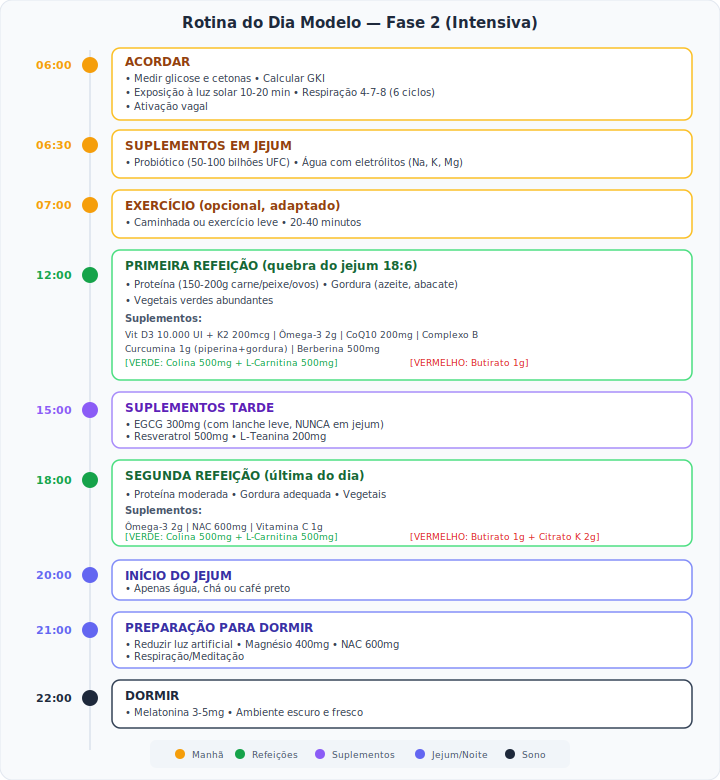

### 9.5 FASE 3: MANUTENÇÃO E AJUSTES (Semana 13+)

**Objetivo:** Manter os ganhos, ajustar baseado em resultados, introduzir ciclos.

#### A. Avaliação de Resposta

Após 12 semanas, avaliar:

1. **Resposta tumoral** (imagem, marcadores)
2. **Composição corporal** (manteve músculo?)
3. **Qualidade de vida** (energia, sono, humor)
4. **Tolerância** (efeitos colaterais?)
5. **Aderência** (conseguiu seguir?)

#### B. Ajustes Baseados em Resultados

| Resultado | Ajuste |
|-----------|--------|
| Tumor respondendo bem | Manter protocolo |
| Tumor estável | Intensificar (jejum mais longo, GKI mais baixo) |
| Progressão | Reavaliar estratégia com oncologista |
| Perda muscular | Aumentar proteína e EAAs, reduzir jejum |
| Fadiga excessiva | Aumentar calorias, verificar tireoide |
| Intolerância GI | Ajustar suplementos, adicionar enzimas |

#### C. Ciclos de Intensificação

**CICLO METABÓLICO MENSAL (opcional):**

```
Semana 1-3: Protocolo padrão
Semana 4: Intensificação
├── Jejum prolongado (36-48h)
├── Cetose profunda (GKI < 1.0)
├── Anti-glutamina intensivo
└── Seguido de realimentação gradual
```

**⚠️ NOTA:** Ciclos de intensificação devem ser discutidos com equipe médica.

---


## Capítulo 10: Intervenções Avançadas — Sob Supervisão Médica

### ⚠️ O PARADOXO OXIDATIVO — Leia Antes de Prosseguir

Ao longo deste protocolo, discutimos extensivamente o uso de suplementos **antioxidantes** (como o NAC, a Vitamina C oral, a Vitamina E e os polifenóis) para proteger as células saudáveis, detoxificar o fígado e modular a inflamação. Isso pode parecer contraditório quando, neste capítulo, apresentamos terapias que funcionam por um princípio completamente oposto: o **estresse oxidativo seletivo** (também conhecido como terapia pró-oxidante).

A verdade é que o câncer vive num equilíbrio antioxidante precário. Para sobreviver ao seu próprio crescimento caótico e ao ataque quimioterápico, a célula tumoral aumenta seus escudos antioxidantes internos (glutationa, por exemplo). Quando usamos Vitamina C Intravenosa em altas doses, Oxigenoterapia Hiperbárica ou Artemisinina, nós criamos uma quantidade avassaladora de espécies reativas de oxigênio (ROS) que sobrecarrega esse sistema de proteção do tumor. A célula cancerígena entra em colapso oxidativo e morre por um processo chamado **Ferroptose**.

**Portanto, há dois modos distintos no Protocolo P8:**

1. **Modo Protetor (Antioxidante Basal):** Uso diário de antioxidantes em doses fisiológicas (NAC 600mg 2x/dia, Vitamina C oral 2-3g, Vitamina E, etc.) para proteger células saudáveis, fígado e sistema imunológico. Este é o modo padrão.

2. **Modo Oxidativo (Pró-oxidante Agudo):** Sessões específicas de Vitamina C IV, Hiperbárica ou Artemisinina, onde geramos um pico de ROS para atacar o tumor. Estas sessões são PONTUAIS, não diárias.

**A Regra de Ouro do Timing:**

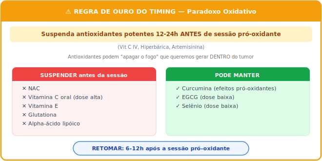

Este capítulo detalha terapias avançadas que **REQUEREM supervisão médica especializada**. Não tente implementá-las sozinho.

### 10.1 Vitamina C Intravenosa (IVC)

#### Mecanismo de Ação

Em doses farmacológicas (25-100g IV), a Vitamina C não atua como antioxidante — atua como **pró-oxidante seletivo**.

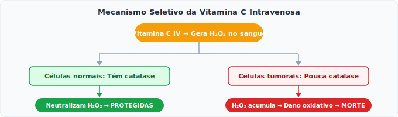

#### Protocolo Padrão

| Parâmetro | Especificação |
|-----------|---------------|
| **Dose** | 25-75g por sessão (titular gradualmente) |
| **Frequência** | 2-3x/semana |
| **Duração** | 2-3 horas de infusão |
| **Osmolaridade** | Verificar e ajustar |

#### Pré-Requisitos OBRIGATÓRIOS

1. **Teste de G6PD** — OBRIGATÓRIO antes da primeira infusão
   - Se deficiente: **CONTRAINDICAÇÃO ABSOLUTA** (risco de hemólise grave)
2. **Função renal** — Creatinina normal
3. **Histórico de cálculos** — Hidratar bem, citrato
4. **Ferro sérico** — Verificar (Vit C aumenta absorção)

#### Sinergia com Outros Tratamentos

| Combinação | Evidência |
|------------|-----------|
| IVC + Quimioterapia | Reduz toxicidade, pode aumentar eficácia |
| IVC + Radioterapia | Pode proteger tecido normal |
| IVC + Cetose | Sinergismo metabólico |
| IVC + Hiperbárica | Dano oxidativo amplificado |

### 10.2 Oxigenoterapia Hiperbárica (OHB)

#### Mecanismo

Respirar oxigênio 100% a 2-2.5 ATA (atmosferas) aumenta dramaticamente o O₂ dissolvido no plasma.

**Efeitos:**
- Hipóxia tumoral → Normóxia forçada → Sensibiliza tumor
- Aumenta ROS → Dano oxidativo ao tumor
- Melhora penetração de quimioterápicos
- Reduz angiogênese tumoral

#### Protocolo Padrão

| Parâmetro | Especificação |
|-----------|---------------|
| **Pressão** | 2.0-2.4 ATA |
| **Duração** | 60-90 minutos |
| **Frequência** | 3-5x/semana |
| **Ciclo** | 20-40 sessões |

#### Contraindicações

- Pneumotórax não tratado
- Certas quimioterapias (bleomicina)
- Claustrofobia severa
- Infecções respiratórias ativas

### 10.3 DCA (Dicloroacetato de Sódio)

#### ⚠️ INTERVENÇÃO DE ALTO RISCO — APENAS COM SUPERVISÃO MÉDICA RIGOROSA

O DCA inibe a piruvato desidrogenase quinase (PDK), forçando a célula tumoral a usar a mitocôndria (que está defeituosa), levando à apoptose.

#### Protocolo (Se Supervisionado)

| Parâmetro | Especificação |
|-----------|---------------|
| **Dose** | 10-12.5 mg/kg/dia (MÁXIMO) |
| **Divisão** | 2-3 doses diárias |
| **Ciclagem** | 2 semanas on / 1 semana off |

#### ⚠️ OBRIGATÓRIO COM DCA

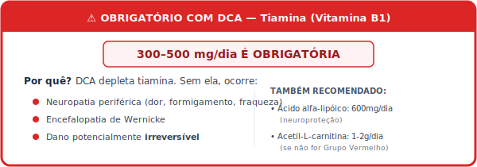

#### Contraindicações Absolutas para DCA

- Neuropatia pré-existente
- Doença hepática
- Deficiência de tiamina não corrigida
- Uso de metformina em dose alta

### 10.4 Artemisinina e Derivados (Ferroptose)

#### Mecanismo

A Artemisinina (extraída da Artemisia annua) reage com ferro intracelular, gerando radicais livres que induzem ferroptose (morte celular dependente de ferro).

Células tumorais têm **mais ferro** → Mais vulneráveis

#### Protocolo

| Composto | Dose | Timing |
|----------|------|--------|
| **Artemisinina** | 200-400mg | Noite, estômago vazio |
| **Artesunato** | 100-200mg | Alternativa mais potente |

**CICLAGEM OBRIGATÓRIA:** 3 dias on / 4 dias off (evita resistência)

#### Potencialização com Ferro

Alguns protocolos usam suplementação de ferro 4-6h antes da Artemisinina para "carregar" as células tumorais. **Isso é controverso e potencialmente perigoso** — apenas com supervisão especializada.

#### Contraindicações

- Gravidez
- Anemia severa
- Deficiência de G6PD
- Uso concomitante de anticoagulantes

### 10.5 Metformina Off-Label

#### Mecanismo Anticâncer

- Inibe Complexo I mitocondrial
- Ativa AMPK → Inibe mTOR
- Reduz insulina e IGF-1
- Sinergia com cetose

#### Protocolo Oncológico

| Parâmetro | Especificação |
|-----------|---------------|
| **Dose** | 500-2000mg/dia |
| **Titulação** | Iniciar 500mg, aumentar gradualmente |
| **Timing** | Com refeições (reduz efeitos GI) |

#### Precauções

- Monitorar função renal
- Evitar jejum >24h (risco de acidose láctica)
- Monitorar B12 (metformina depleta)

### 10.6 Quimioterapia Metronômica

Alguns oncologistas usam quimioterapia em doses baixas contínuas (em vez de altas doses cíclicas):

**Vantagens potenciais:**
- Efeito anti-angiogênico
- Menos toxicidade
- Pode ser combinada com protocolo metabólico
- Melhor qualidade de vida

**Drogas comuns:** Ciclofosfamida oral, Capecitabina

**⚠️ DECISÃO DO ONCOLOGISTA** — não auto-implementar.

### 10.7 Imunoterapia e o Protocolo P8

A combinação de imunoterapia (anti-PD-1, anti-CTLA-4) com o Protocolo P8 é potencialmente sinérgica:

| Intervenção P8 | Efeito na Imunoterapia |
|----------------|------------------------|
| Cetose | Melhora função de células T |
| TMAO (Grupo Verde) | Potencializa resposta (até 4x) |
| Jejum | Pode melhorar resposta imune |
| Probióticos | Modulam resposta (Akkermansia!) |

**Coordenar com oncologista para timing ideal.**

---


## Capítulo 11: Casos Clínicos Ilustrativos

### ⚠️ NOTA IMPORTANTE

Os casos abaixo são **ilustrativos e educacionais**, baseados em padrões observados na literatura e na prática clínica integrativa. Eles demonstram como o protocolo pode ser aplicado em diferentes situações, mas **não garantem resultados similares**. Cada paciente é único.

### Caso 1: Adenocarcinoma de Pâncreas — GRUPO VERDE

**Paciente:** Homem, 62 anos  
**Diagnóstico:** Adenocarcinoma de pâncreas, estágio IIB, pós-Whipple  
**Tratamento convencional:** FOLFIRINOX adjuvante  

**Implementação P8:**
- Classificação: GRUPO VERDE → Elevar TMAO
- Dieta cetogênica estrita (GKI < 3.0)
- Jejum 18:6 nos dias sem quimioterapia
- Colina 1g/dia + L-Carnitina 1g/dia
- TMAO monitorado: elevou de 4 μM para 18 μM
- Suplementação completa conforme protocolo
- Vitamina C IV 50g 2x/semana (entre ciclos de QT)

**Resultados após 6 meses:**
- CA 19-9: 340 → 45 U/mL
- Tolerância à QT: excelente (completou todos os ciclos)
- Peso: mantido (perdeu gordura, manteve músculo)
- PET-CT: sem evidência de recorrência

**Lições:** A elevação de TMAO em pâncreas, combinada com cetose e imunomodulação, pode potencializar resposta ao tratamento convencional.

---

### Caso 2: Câncer Colorretal Metastático — GRUPO VERMELHO

**Paciente:** Mulher, 55 anos  
**Diagnóstico:** Adenocarcinoma de cólon, estágio IV (metástases hepáticas)  
**Tratamento convencional:** FOLFOX + Bevacizumab  

**Implementação P8:**
- Classificação: GRUPO VERMELHO → Suprimir TMAO
- Dieta cetogênica profunda (GKI < 1.0)
- Jejum 20:4 (OMAD)
- **ZERO** colina/carnitina suplementar
- Proteína predominantemente vegetal + peixe branco
- Butirato 2g 2x/dia
- Sulforafano 100mg/dia
- Citrato de Potássio 3g/dia (com monitoramento de K sérico)
- Aspirina 100mg/dia (coordenado com oncologista)

**Resultados após 9 meses:**
- CEA: 89 → 12 ng/mL
- TMAO: mantido < 4 μM
- TC: redução de 60% nas metástases hepáticas
- Considerada para ressecção hepática (antes inoperável)

**Lições:** No Grupo Vermelho, a supressão de TMAO + cetose profunda + butirato podem criar ambiente hostil ao tumor colorretal.

---

### Caso 3: Mama Triplo-Negativo (TNBC) — GRUPO VERDE com Protocolo BACH1

**Paciente:** Mulher, 48 anos  
**Diagnóstico:** Carcinoma ductal invasivo triplo-negativo, estágio IIIA  
**Tratamento convencional:** AC-T neoadjuvante → Cirurgia → Radioterapia  

**Implementação P8:**
- Classificação: GRUPO VERDE (TNBC) → Elevar TMAO
- **⚠️ Protocolo BACH1 OBRIGATÓRIO:**
  - NAC 1200mg 2x/dia (proteção contra metástase)
  - Vitamina E 400 UI/dia
  - Selênio 200mcg/dia
- Dieta cetogênica (GKI < 3.0, não ultra-profunda)
- Jejum 48h antes de cada ciclo de AC
- Colina 500mg + L-Carnitina 500mg (para TMAO)
- Monitoramento de imagem mais frequente (a cada 6 semanas)

**Resultados:**
- Resposta patológica completa (pCR) na cirurgia
- Tolerância à QT: boa (completou todos os ciclos)
- Sem evidência de metástase durante follow-up
- Qualidade de vida preservada

**Lições:** Em TNBC, a cetose pode ser usada, mas o Protocolo BACH1 (NAC obrigatório) é ESSENCIAL para prevenir ativação de vias metastáticas.

---

### Caso 4: Melanoma Avançado — GRUPO VERDE + Imunoterapia

**Paciente:** Homem, 58 anos  
**Diagnóstico:** Melanoma metastático, BRAF wild-type  
**Tratamento convencional:** Pembrolizumab (anti-PD-1)  

**Implementação P8:**
- Classificação: GRUPO VERDE → Elevar TMAO
- Colina 1g + L-Carnitina 1g/dia
- TMAO: 6 μM → 16 μM
- Dieta cetogênica moderada (GKI 2-3)
- Probióticos específicos (Akkermansia muciniphila)
- Jejum 24h antes de cada infusão de Pembrolizumab

**Resultados após 12 meses:**
- Resposta completa em 3 de 4 lesões metastáticas
- Quarta lesão: estável
- Sem toxicidade imunomediada significativa
- Continua em tratamento com doença controlada

**Lições:** A elevação de TMAO pode potencializar imunoterapia em melanoma (replicando achados do estudo Science Immunology 2022).

---

### Caso 5: Glioblastoma — GRUPO VERDE + Cetose Terapêutica

**Paciente:** Mulher, 45 anos  
**Diagnóstico:** Glioblastoma multiforme (GBM), pós-ressecção subtotal  
**Tratamento convencional:** Temozolomida + Radioterapia (Stupp protocol)  

**Implementação P8:**
- Classificação: GRUPO VERDE → Elevar TMAO
- Dieta cetogênica estrita (GKI < 1.5 — cérebro é órgão-alvo)
- Jejum prolongado semanal (36-48h)
- Colina 500mg + L-Carnitina 500mg
- Oxigenoterapia hiperbárica 3x/semana
- Metformina 1500mg/dia
- Curcumina lipossomal 2g/dia (atravessa barreira hematoencefálica)

**Resultados após 18 meses:**
- Sobrevida > 18 meses (mediana para GBM: 15 meses)
- RM: lesão estável, sem nova progressão
- Função cognitiva preservada
- Qualidade de vida boa

**Lições:** GBM é altamente dependente de glicose. Cetose profunda + hiperbárica podem criar ambiente hostil ao tumor cerebral.

---

### Caso 6: Câncer de Próstata — GRUPO VERMELHO + Hormônio

**Paciente:** Homem, 68 anos  
**Diagnóstico:** Adenocarcinoma de próstata, Gleason 8, metástases ósseas  
**Tratamento convencional:** Deprivação androgênica (ADT) + Abiraterona  

**Implementação P8:**
- Classificação: GRUPO VERMELHO → Suprimir TMAO
- **ZERO** colina/carnitina suplementar
- Dieta cetogênica profunda (GKI < 1.0)
- Proteína predominantemente vegetal
- Licopeno 50mg/dia
- Citrato de Potássio 3g/dia
- Butirato 2g 2x/dia
- Vitamina D 10.000 UI + K2
- Exercício resistido 3x/semana (preservar massa óssea)

**Resultados após 12 meses:**
- PSA: 89 → 0.8 ng/mL
- Cintilografia: redução de captação nas lesões ósseas
- TMAO mantido < 5 μM
- Força e massa muscular preservadas
- Sem fraturas

**Lições:** No câncer de próstata (Grupo Vermelho), a combinação de ADT + cetose + supressão de TMAO + licopeno pode ser sinérgica.

---


## Capítulo 12: Implementação Prática e Custos

### 12.1 Guia de Implementação por Perfil

#### PARA PACIENTES:

**Se você está lendo isso como paciente:**

1. **Não entre em pânico.** Este protocolo é denso, mas pode ser implementado gradualmente.

2. **Imprima o Capítulo 3** e leve ao seu oncologista. Pergunte: "Meu câncer está no Grupo Verde, Amarelo ou Vermelho para TMAO?"

3. **Comece pela dieta.** A transição alimentar é o passo mais impactante e não requer prescrição médica.

4. **Adicione suplementos gradualmente.** Não tente tomar tudo no primeiro dia.

5. **Monitore-se.** Compre um medidor de glicose e cetonas. Calcule seu GKI diariamente.

6. **Encontre aliados.** Grupos de apoio, nutricionistas funcionais, médicos integrativos.

7. **Seja paciente.** Resultados metabólicos levam 4-8 semanas para se estabelecer.

---

#### PARA ONCOLOGISTAS:

**Se você é oncologista lendo isso:**

1. **Reconhecemos seu ceticismo.** É compreensível. A formação oncológica tradicional não inclui metabolismo tumoral ou microbiota.

2. **Veja a Parte III (Referências).** Cada intervenção está ancorada em literatura peer-reviewed.

3. **O protocolo é COMPLEMENTAR.** Não estamos propondo substituir quimioterapia, cirurgia ou imunoterapia. Estamos propondo otimizar o terreno biológico para que seus tratamentos funcionem melhor.

4. **Considere o risco-benefício.** Dieta cetogênica e jejum intermitente têm perfil de segurança excelente. Suplementos básicos também.

5. **Monitore junto.** Se seu paciente quiser seguir o protocolo, acompanhe. Peça os exames sugeridos. Veja os resultados.

6. **A ciência está mudando.** Ensaios clínicos de cetose em oncologia estão em andamento. Os resultados preliminares são promissores.

---

#### PARA NUTRICIONISTAS E PROFISSIONAIS INTEGRATIVOS:

**Se você é profissional de saúde integrativa:**

1. **Use este documento como base.** Ele compila evidências que você pode apresentar a oncologistas.

2. **Adapte ao paciente.** Nem todos toleram cetose estrita. Ajuste conforme necessário.

3. **Monitore composição corporal.** Sarcopenia é risco real. Proteja o músculo.

4. **Coordene com a equipe oncológica.** Comunicação é essencial.

5. **Documente resultados.** Contribua para a base de evidências.

---

### 12.2 Estimativa de Custos Mensais

#### Nível 1: Essencial (Mínimo Viável)

| Item | Custo Estimado (R$) |
|------|---------------------|
| Alimentação cetogênica | 800-1.200 |
| Suplementos básicos (D3, Mg, Ômega-3, B) | 150-250 |
| Medidor de glicose/cetonas + tiras | 100-200 |
| **TOTAL MENSAL** | **1.050-1.650** |

#### Nível 2: Intermediário (Recomendado)

| Item | Custo Estimado (R$) |
|------|---------------------|
| Alimentação cetogênica (orgânicos) | 1.200-1.800 |
| Suplementos completos | 400-700 |
| Exames mensais (particular) | 200-400 |
| Consulta nutricional | 200-400 |
| **TOTAL MENSAL** | **2.000-3.300** |

#### Nível 3: Avançado (Máximo)

| Item | Custo Estimado (R$) |
|------|---------------------|
| Alimentação premium | 2.000-3.000 |
| Suplementos premium | 800-1.500 |
| Exames completos | 500-1.000 |
| Vitamina C IV (4 sessões) | 800-1.600 |
| Hiperbárica (8 sessões) | 1.200-2.400 |
| Equipe integrativa | 500-1.000 |
| **TOTAL MENSAL** | **5.800-10.500** |

**NOTA:** Valores estimados para Brasil em 2026. Podem variar por região.

### 12.3 Onde Encontrar Suplementos

#### Suplementos Básicos
- Farmácias de manipulação
- Lojas de suplementos (físicas e online)
- Importação direta (iHerb, Amazon — verificar legislação)

#### Suplementos Específicos (Artemisinina, DCA, etc.)
- Farmácias de manipulação especializadas
- Importação (requer receita em alguns casos)
- Consultar médico integrativo

### 12.4 Encontrando Profissionais

**O que procurar:**
- Médico integrativo ou funcional com experiência em oncologia
- Nutricionista com formação em dieta cetogênica
- Oncologista aberto a abordagens complementares

**Onde procurar:**
- Sociedades de medicina integrativa
- Referências de outros pacientes
- Clínicas de medicina funcional

### 12.5 Checklist de Implementação

**SEMANA 1:**
- [ ] Ler documento completo
- [ ] Identificar GRUPO (Verde/Amarelo/Vermelho)
- [ ] Verificar contraindicações
- [ ] Conversar com oncologista
- [ ] Agendar exames basais
- [ ] Comprar medidor de glicose/cetonas

**SEMANA 2:**
- [ ] Iniciar limpeza alimentar
- [ ] Eliminar açúcar e ultraprocessados
- [ ] Comprar suplementos básicos
- [ ] Iniciar diário alimentar

**SEMANA 3-4:**
- [ ] Transição para cetogênica
- [ ] Iniciar jejum 12:12 → 16:8
- [ ] Medir glicose e cetonas diariamente
- [ ] Calcular GKI

**SEMANA 5-8:**
- [ ] Cetose estabelecida
- [ ] Jejum 18:6 ou 20:4
- [ ] Suplementação completa por GRUPO
- [ ] Exames de acompanhamento

**SEMANA 9-12:**
- [ ] Ajustes baseados em resultados
- [ ] Intensificação se necessário
- [ ] Reavaliação com equipe médica

---

# PARTE III: A CIÊNCIA POR TRÁS

## Capítulo 13: Referências Científicas Principais

### Metabolismo Tumoral e Efeito Warburg

1. **Warburg O.** On the origin of cancer cells. *Science*. 1956;123(3191):309-314. DOI: 10.1126/science.123.3191.309

2. **Seyfried TN, Shelton LM.** Cancer as a metabolic disease. *Nutr Metab (Lond)*. 2010;7:7. DOI: 10.1186/1743-7075-7-7

3. **Seyfried TN et al.** Press-pulse: a novel therapeutic strategy for the metabolic management of cancer. *Nutr Metab (Lond)*. 2017;14:19. DOI: 10.1186/s12986-017-0178-2

4. **Vander Heiden MG, Cantley LC, Thompson CB.** Understanding the Warburg effect: the metabolic requirements of cell proliferation. *Science*. 2009;324(5930):1029-1033. DOI: 10.1126/science.1160809

### Dieta Cetogênica em Oncologia

5. **Weber DD et al.** Ketogenic diet in cancer therapy. *Aging (Albany NY)*. 2018;10(2):164-165. DOI: 10.18632/aging.101382

6. **Klement RJ, Kämmerer U.** Is there a role for carbohydrate restriction in the treatment and prevention of cancer? *Nutr Metab (Lond)*. 2011;8:75. DOI: 10.1186/1743-7075-8-75

7. **Poff AM et al.** Targeting the Warburg effect for cancer treatment: Ketogenic diets for management of glioma. *Semin Cancer Biol*. 2019;56:135-148. DOI: 10.1016/j.semcancer.2017.12.011

8. **Tan-Shalaby J.** Ketogenic Diets and Cancer: Emerging Evidence. *Fed Pract*. 2017;34(Suppl 1):37S-42S. PMID: 30766299

### Jejum e Quimioterapia

9. **Lee C et al.** Fasting cycles retard growth of tumors and sensitize a range of cancer cell types to chemotherapy. *Sci Transl Med*. 2012;4(124):124ra27. DOI: 10.1126/scitranslmed.3003293

10. **Raffaghello L et al.** Starvation-dependent differential stress resistance protects normal but not cancer cells against high-dose chemotherapy. *Proc Natl Acad Sci USA*. 2008;105(24):8215-8220. DOI: 10.1073/pnas.0708100105

11. **de Groot S et al.** The effects of short-term fasting on tolerance to (neo) adjuvant chemotherapy in HER2-negative breast cancer patients: a randomized pilot study. *BMC Cancer*. 2015;15:652. DOI: 10.1186/s12885-015-1663-5

12. **Dorff TB et al.** Safety and feasibility of fasting in combination with platinum-based chemotherapy. *BMC Cancer*. 2016;16:360. DOI: 10.1186/s12885-016-2370-6

### TMAO e Imunidade Antitumoral

13. **Mirji G et al.** The microbiome-derived metabolite TMAO drives immune activation and boosts responses to immune checkpoint blockade in pancreatic cancer. *Science Immunology*. 2022;7(75):eabn0704. DOI: 10.1126/sciimmunol.abn0704

14. **Wang Z et al.** Gut flora metabolism of phosphatidylcholine promotes cardiovascular disease. *Nature*. 2011;472(7341):57-63. DOI: 10.1038/nature09922

15. **Xu R et al.** Gut microbiota-dependent metabolite TMAO promotes colorectal cancer proliferation via the Wnt/β-catenin signaling pathway. *Frontiers in Oncology*. 2022;12:862143. DOI: 10.3389/fonc.2022.862143

16. **Liu X et al.** Trimethylamine N-oxide promotes hepatocellular carcinoma progression. *Cell Death & Disease*. 2018;9(12):1191. DOI: 10.1038/s41419-018-1232-2

### Microbiota e Câncer

17. **Routy B et al.** Gut microbiome influences efficacy of PD-1–based immunotherapy against epithelial tumors. *Science*. 2018;359(6371):91-97. DOI: 10.1126/science.aan3706

18. **Gopalakrishnan V et al.** Gut microbiome modulates response to anti–PD-1 immunotherapy in melanoma patients. *Science*. 2018;359(6371):97-103. DOI: 10.1126/science.aan4236

19. **Donohoe DR et al.** The Warburg effect dictates the mechanism of butyrate-mediated histone acetylation and cell proliferation. *Mol Cell*. 2012;48(4):612-626. DOI: 10.1016/j.molcel.2012.08.033

### Butirato

20. **Thangaraju M et al.** GPR109A is a G-protein-coupled receptor for the bacterial fermentation product butyrate and functions as a tumor suppressor in colon. *Cancer Res*. 2009;69(7):2826-2832. DOI: 10.1158/0008-5472.CAN-08-4466

21. **Davie JR.** Inhibition of histone deacetylase activity by butyrate. *J Nutr*. 2003;133(7 Suppl):2485S-2493S. DOI: 10.1093/jn/133.7.2485S

22. **Banasiewicz T et al.** Determination of butyric acid dosage based on clinical and experimental studies - a literature review. *Prz Gastroenterol*. 2020;15(2):119-125. DOI: 10.5114/pg.2020.95556

### Cronobiologia e Câncer

23. **Sulli G et al.** Interplay between Circadian Clock and Cancer: New Frontiers for Cancer Treatment. *Trends Cancer*. 2019;5(8):475-494. DOI: 10.1016/j.trecan.2019.07.002

24. **Lévi F et al.** Chronomodulated chemotherapy against metastatic colorectal cancer. *Eur J Cancer*. 2001;37 Suppl 4:S11-S20. DOI: 10.1016/S0959-8049(01)00111-7

25. **Papagiannakopoulos T et al.** Circadian Rhythm Disruption Promotes Lung Tumorigenesis. *Cell Metab*. 2016;24(2):324-331. DOI: 10.1016/j.cmet.2016.07.001

### Vitamina C Intravenosa

26. **Padayatty SJ et al.** Intravenously administered vitamin C as cancer therapy: three cases. *CMAJ*. 2006;174(7):937-942. DOI: 10.1503/cmaj.050346

27. **Chen Q et al.** Pharmacologic doses of ascorbate act as a prooxidant and decrease growth of aggressive tumor xenografts in mice. *Proc Natl Acad Sci USA*. 2008;105(32):11105-11109. DOI: 10.1073/pnas.0804226105

28. **Ma Y et al.** High-dose parenteral ascorbate enhanced chemosensitivity of ovarian cancer and reduced toxicity of chemotherapy. *Sci Transl Med*. 2014;6(222):222ra18. DOI: 10.1126/scitranslmed.3007154

### Oxigenoterapia Hiperbárica

29. **Moen I, Stuhr LE.** Hyperbaric oxygen therapy and cancer—a review. *Target Oncol*. 2012;7(4):233-242. DOI: 10.1007/s11523-012-0233-x

30. **Poff AM et al.** The ketogenic diet and hyperbaric oxygen therapy prolong survival in mice with systemic metastatic cancer. *PLoS One*. 2013;8(6):e65522. DOI: 10.1371/journal.pone.0065522

### DCA (Dicloroacetato)

31. **Michelakis ED et al.** Metabolic modulation of glioblastoma with dichloroacetate. *Sci Transl Med*. 2010;2(31):31ra34. DOI: 10.1126/scitranslmed.3000677

32. **Bonnet S et al.** A mitochondria-K+ channel axis is suppressed in cancer and its normalization promotes apoptosis and inhibits cancer growth. *Cancer Cell*. 2007;11(1):37-51. DOI: 10.1016/j.ccr.2006.10.020

### Artemisinina

33. **Efferth T.** From ancient herb to modern drug: Artemisia annua and artemisinin for cancer therapy. *Semin Cancer Biol*. 2017;46:65-83. DOI: 10.1016/j.semcancer.2017.02.009

34. **Zhang S et al.** Artemisinin derivatives and their anticancer activity. *Curr Med Chem Anticancer Agents*. 2005;5(1):63-73. DOI: 10.2174/1568011053352604

### Metformina

35. **Evans JM et al.** Metformin and reduced risk of cancer in diabetic patients. *BMJ*. 2005;330(7503):1304-1305. DOI: 10.1136/bmj.38415.708634.F7

36. **Wheaton WW et al.** Metformin inhibits mitochondrial complex I of cancer cells to reduce tumorigenesis. *Elife*. 2014;3:e02242. DOI: 10.7554/eLife.02242

### Nervo Vago e Câncer

37. **Tracey KJ.** Reflex control of immunity. *Nat Rev Immunol*. 2009;9(6):418-428. DOI: 10.1038/nri2566

38. **De Couck M, Mravec B, Gidron Y.** You may need the vagus nerve to understand pathophysiology and to treat diseases. *Clin Sci (Lond)*. 2012;122(7):323-328. DOI: 10.1042/CS20110299

### Protocolo BACH1 (Metástase em Cetose)

39. **Su Z et al.** An unexpected role for the ketogenic diet in triggering tumor metastasis by modulating BACH1-mediated transcription. *Science Advances*. 2024;10(23):eadm9481. DOI: 10.1126/sciadv.adm9481

### Glutaminólise

40. **Wise DR, Thompson CB.** Glutamine addiction: a new therapeutic target in cancer. *Trends Biochem Sci*. 2010;35(8):427-433. DOI: 10.1016/j.tibs.2010.05.003

41. **Jin L et al.** Glutamate Dehydrogenase 1 Signals through Antioxidant Glutathione Peroxidase 1 to Regulate Redox Homeostasis and Tumor Growth. *Cancer Cell*. 2015;27(2):257-270. DOI: 10.1016/j.ccell.2014.12.006

---


## Capítulo 14: Leituras Recomendadas e Recursos

### Livros Fundamentais

1. **"Cancer as a Metabolic Disease"** — Thomas Seyfried (2012)
   - A obra definitiva sobre a teoria metabólica do câncer

2. **"Tripping Over the Truth"** — Travis Christofferson (2014)
   - História acessível da teoria metabólica para leigos

3. **"The Metabolic Approach to Cancer"** — Nasha Winters & Jess Higgins Kelley (2017)
   - Guia prático de implementação integrativa

4. **"Keto for Cancer"** — Miriam Kalamian (2017)
   - Manual prático de dieta cetogênica oncológica

5. **"The Complete Guide to Fasting"** — Jason Fung & Jimmy Moore (2016)
   - Fundamentos do jejum terapêutico

### Artigos de Revisão Essenciais

- Hanahan D, Weinberg RA. "Hallmarks of Cancer: The Next Generation." *Cell*. 2011.
- Pavlova NN, Thompson CB. "The Emerging Hallmarks of Cancer Metabolism." *Cell Metab*. 2016.
- Klement RJ. "Beneficial effects of ketogenic diets for cancer patients: a realist review with focus on evidence and confirmation." *Med Oncol*. 2017.

### Sites e Recursos Online

- **PubMed** (pubmed.ncbi.nlm.nih.gov) — Pesquisa de literatura científica
- **ClinicalTrials.gov** — Ensaios clínicos em andamento
- **Examine.com** — Evidências sobre suplementos
- **Diet Doctor** (dietdoctor.com) — Recursos sobre cetogênica

### Grupos e Comunidades

- Grupos de apoio a pacientes oncológicos
- Comunidades de dieta cetogênica
- Fóruns de medicina integrativa

---


# APÊNDICES

## Apêndice A: Lista Completa de Suplementos por Nível de Custo

### Nível 1: Protocolo Essencial (Baixo Custo)

**Custo estimado:** R$ 300-500/mês

| Suplemento | Dose | Função | Prioridade |
|------------|------|--------|------------|
| Vitamina D3 | 10.000 UI/dia | Imunomodulação | ESSENCIAL |
| Ômega-3 (óleo de peixe) | 3g/dia | Anti-inflamatório | ESSENCIAL |
| Magnésio glicinato | 400mg/dia | Enzimas, sono | ESSENCIAL |
| Vitamina C | 2g/dia | Imunidade | ESSENCIAL |
| Complexo B | Padrão | Energia | IMPORTANTE |
| Probiótico básico | 10-30 bi UFC | Microbiota | IMPORTANTE |

### Nível 2: Protocolo Intermediário (Custo Moderado)

**Custo estimado:** R$ 500-1.000/mês

*Inclui tudo do Nível 1, mais:*

| Suplemento | Dose | Função | Prioridade |
|------------|------|--------|------------|
| NAC | 600mg 2x/dia | Glutationa | ESSENCIAL |
| CoQ10 (ubiquinol) | 200mg/dia | Mitocôndria | IMPORTANTE |
| Curcumina lipossomal | 1g/dia | Anti-inflamatório | IMPORTANTE |
| Vitamina K2 (MK-7) | 200mcg/dia | Cálcio | IMPORTANTE |
| Zinco | 30mg/dia | Imunidade | ÚTIL |
| Selênio | 200mcg/dia | Antioxidante | ÚTIL |

### Nível 3: Protocolo Avançado (Custo Elevado)

**Custo estimado:** R$ 1.000-2.000/mês

*Inclui tudo dos Níveis 1 e 2, mais:*

| Suplemento | Dose | Função | Prioridade |
|------------|------|--------|------------|
| EAAs | 10-15g/dia | Músculo | ESSENCIAL |
| HMB | 3g/dia | Anti-catabólico | IMPORTANTE |
| Creatina | 5g/dia | Força | IMPORTANTE |
| Berberina | 500mg 2x/dia | Metabólico | ÚTIL |
| EGCG | 400-600mg/dia | Anti-glutamina | ÚTIL |
| Resveratrol | 500mg/dia | Sirtuínas | OPCIONAL |
| Butirato* | 2-4g/dia | SCFA | POR GRUPO |
| Colina/Carnitina* | Variável | TMAO | POR GRUPO |

*Conforme estratificação TMAO (Capítulo 3)

### Nível 4: Protocolo Completo (Investimento Total)

**Custo estimado:** R$ 2.000-4.000/mês

*Inclui tudo dos níveis anteriores, mais:*

- Probiótico premium multi-cepa (50-100 bi UFC)
- Melatonina 10mg
- Ashwagandha 600mg
- DIM 300mg (se indicado)
- Silimarina 420mg (se indicado)
- Sulforafano 50-100mg

**+ Intervenções Clínicas (custo adicional):**
- Vitamina C IV: R$ 200-500/sessão
- Oxigenoterapia Hiperbárica: R$ 150-400/sessão
- Exames de monitoramento

---


## Apêndice B: Modelo de Registro Diário

### Registro Diário P8

**Data:** ___/___/______

#### Medições Matinais

| Parâmetro | Valor | Meta |
|-----------|-------|------|
| Glicose (mg/dL) | ___ | < 80 |
| Cetonas (mmol/L) | ___ | > 1.0 |
| **GKI** | ___ | < 3.0 (Verde/Amarelo) ou < 1.0 (Vermelho) |
| Peso (kg) | ___ | Estável |
| Pressão arterial | ___/___ | < 130/85 |

**GKI = Glicose (mg/dL) ÷ 18 ÷ Cetonas (mmol/L)**

#### Alimentação

| Refeição | Horário | Descrição | Carbs (g) |
|----------|---------|-----------|-----------|
| 1ª refeição | ___ | | ___ |
| 2ª refeição | ___ | | ___ |
| Snack (se houver) | ___ | | ___ |
| **Total carbs** | | | ___ |

**Janela alimentar:** ___ h às ___ h (___h de jejum)

#### Suplementação

| Manhã | ✓ | Tarde | ✓ | Noite | ✓ |
|-------|---|-------|---|-------|---|
| Vit D | ☐ | Curcumina | ☐ | Magnésio | ☐ |
| Vit K2 | ☐ | Ômega-3 | ☐ | Melatonina | ☐ |
| NAC | ☐ | Berberina | ☐ | NAC | ☐ |
| Complexo B | ☐ | | | | |
| Probiótico | ☐ | | | | |

#### Atividades

| Atividade | Duração | Observações |
|-----------|---------|-------------|
| Exercício | ___ min | Tipo: |
| Ativação vagal manhã | ___ min | ☐ |
| Ativação vagal noite | ___ min | ☐ |
| Exposição solar | ___ min | |
| Sono (noite anterior) | ___ h | Qualidade: 1-10 |

#### Sintomas e Observações

| Sintoma | Intensidade (0-10) |
|---------|-------------------|
| Energia | ___ |
| Clareza mental | ___ |
| Dor | ___ |
| Náusea | ___ |
| Outros: | ___ |

**Observações do dia:**
_______________________________________________

---


## Apêndice C: Protocolo de Emergência

### Sinais de Alerta — Quando Procurar Ajuda Médica IMEDIATAMENTE

#### 🚨 EMERGÊNCIA — VÁ AO PRONTO-SOCORRO

- Confusão mental aguda
- Respiração rápida e profunda (Kussmaul) — pode indicar cetoacidose
- Dor torácica
- Hálito com cheiro de fruta/acetona intenso + mal-estar
- Febre > 38.5°C com neutropenia (em quimioterapia)
- Vômitos incontroláveis > 24h
- Sangramento significativo
- Desmaio

#### ⚠️ ATENÇÃO — CONTATE SEU MÉDICO EM 24H

- Perda de peso > 2kg em 1 semana (sem explicação)
- Fraqueza progressiva
- Diarreia persistente > 3 dias
- Dor abdominal nova
- Urina muito escura ou diminuída
- Edema novo (inchaço)
- Palpitações frequentes
- Glicose < 50 mg/dL com sintomas

#### Manejo de Hipoglicemia

**Se glicose < 70 mg/dL com sintomas (tremor, suor, confusão):**

1. **Não entre em pânico**
2. Consuma 15-20g de carboidratos de absorção rápida:
   - 1 colher de sopa de mel
   - 4-5 balas de glicose
   - 150ml de suco de laranja
3. Aguarde 15 minutos
4. Meça novamente
5. Se ainda < 70, repita
6. Quando estabilizar, faça uma refeição com proteína e gordura

**Se inconsciente:** NÃO dê nada pela boca. Chame emergência.

#### Manejo de Desidratação/Eletrólitos

**Sintomas:** Cãibras, fraqueza, tontura, coração acelerado

**Ação imediata:**
- 1 colher de chá de sal em 500ml de água
- Caldo de osso ou carne
- Suplementar magnésio e potássio
- Se persistir > 24h, procure médico

---


## Apêndice D: Glossário de Termos

| Termo | Definição |
|-------|-----------|
| **Apoptose** | Morte celular programada — suicídio celular controlado |
| **BACH1** | Proteína que pode promover metástases quando ativada por privação de glicose |
| **β-OHB (Beta-hidroxibutirato)** | Principal corpo cetônico, usado como energia e sinalizador |
| **Butirato** | Ácido graxo de cadeia curta produzido por bactérias intestinais |
| **Cetose** | Estado metabólico onde o corpo usa cetonas como combustível principal |
| **Cronoterapia** | Administração de tratamentos em horários específicos para otimizar eficácia |
| **DSR** | Resistência Diferencial ao Estresse — células saudáveis protegidas, tumorais vulneráveis |
| **Efeito Warburg** | Fermentação de glicose por células cancerígenas mesmo com oxigênio disponível |
| **Ferroptose** | Morte celular por acúmulo de ferro e estresse oxidativo |
| **GALT** | Tecido linfoide associado ao intestino — 70-80% do sistema imune |
| **GKI** | Glucose Ketone Index — medida de cetose terapêutica |
| **Glutaminólise** | Via metabólica alternativa usada por tumores para energia |
| **HDAC** | Histona deacetilase — enzima que silencia genes |
| **Hiperbárica** | Terapia com oxigênio sob pressão aumentada |
| **IGF-1** | Fator de crescimento semelhante à insulina |
| **Microbiota** | Comunidade de microrganismos que habitam o intestino |
| **mTOR** | Via de sinalização de crescimento celular |
| **NAC** | N-Acetilcisteína — precursor de glutationa |
| **Nervo Vago** | Principal nervo parassimpático, modula inflamação |
| **Pós-bióticos** | Metabólitos produzidos por bactérias intestinais |
| **ROS** | Espécies reativas de oxigênio — causam estresse oxidativo |
| **TMAO** | Óxido de trimetilamina — metabólito com efeitos variáveis por tipo de câncer |
| **TNBC** | Câncer de mama triplo-negativo |

---


## Apêndice E: Perguntas Frequentes (FAQ)

### Sobre a Dieta

**P: Posso fazer cetogênica durante a quimioterapia?**
R: Sim, evidências sugerem que é seguro e pode ser benéfico. Informe seu oncologista e monitore-se de perto.

**P: Vou perder muito peso?**
R: A perda de gordura é esperada, mas a perda muscular deve ser evitada. Siga o protocolo anti-sarcopenia (Capítulo 4).

**P: E se eu tiver náusea e não conseguir comer?**
R: Priorize líquidos cetogênicos (caldo de osso, smoothies com MCT). Se persistir > 48h, procure orientação médica.

### Sobre Suplementos

**P: Preciso tomar TODOS os suplementos listados?**
R: Não. Comece pelo Nível 1 (essenciais) e adicione conforme possibilidade e necessidade.

**P: Posso tomar suplementos junto com quimioterapia?**
R: Alguns sim, outros não. Suspenda antioxidantes fortes 24-48h antes e depois de cada sessão de quimio. Consulte seu oncologista.

**P: E se eu for do Grupo Vermelho e quiser tomar Carnitina para energia?**
R: NÃO TOME. O risco de elevar TMAO supera qualquer benefício. Use creatina e CoQ10 como alternativas.

### Sobre Jejum

**P: Posso jejuar se estou perdendo peso?**
R: Se houver perda muscular ativa, modere o jejum (12-14h máximo) até estabilizar. Priorize proteína.

**P: Jejum prolongado é seguro durante o tratamento?**
R: Jejuns de 24-48h antes da quimio mostram benefícios em estudos, mas devem ser supervisionados.

### Sobre Monitoramento

**P: Com que frequência devo medir GKI?**
R: Diariamente nas primeiras semanas, depois 3-4x/semana quando estabilizar.

**P: Que exames devo repetir e quando?**
R: Veja o cronograma no Capítulo 9. Em geral: PCR-us semanal, marcadores tumorais mensais, TMAO quinzenal.

### Sobre Interações

**P: Posso tomar Metformina junto com cetogênica?**
R: Sim, é uma combinação sinérgica. Evite apenas jejuns > 24h se usar Metformina.

**P: E se meu oncologista for contra?**
R: Apresente as referências científicas (Parte III). Se ainda houver resistência, busque uma segunda opinião de um oncologista integrativo.

---


## Apêndice F: Resumos Visuais (Para Colar na Geladeira)

### F.1 Resumo do Sistema Semáforo TMAO

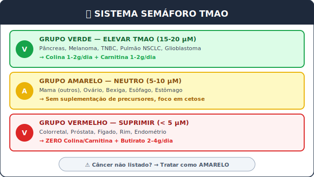

### F.2 Tipos principais: Cuidados Especiais

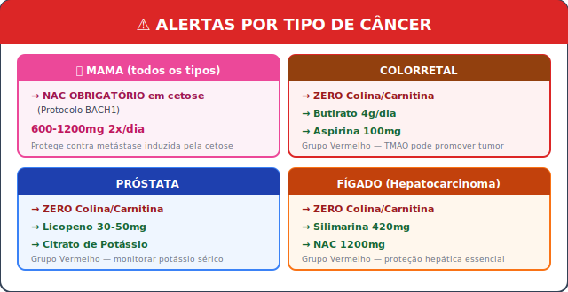

### F.3 Checklist Diário Rápido

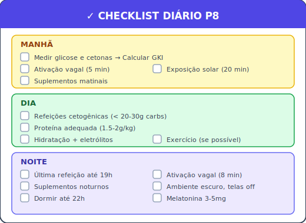

### F.4 Regras de Ouro (Nunca Esqueça)

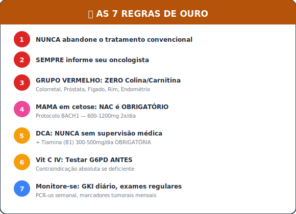

---


# TERMO DE RESPONSABILIDADE E CONSENTIMENTO

**O download, a leitura e a utilização prática das informações contidas neste documento implicam na aceitação tácita e digital dos seguintes termos. Declaro que:**

1. **Li e compreendi** todos os avisos, contraindicações e precauções apresentados.

2. **Entendo** que este material é educacional e não substitui orientação médica profissional.

3. **Comprometo-me** a informar minha equipe médica sobre qualquer intervenção que pretendo implementar.

4. **Aceito** que a aplicação destas estratégias é de minha inteira responsabilidade.

5. **Reconheço** que resultados individuais variam e que não há garantia de eficácia.

6. **Identificarei** meu GRUPO (Verde/Amarelo/Vermelho) e seguirei RIGOROSAMENTE o protocolo correspondente.

7. **Isento** o autor e distribuidores deste material de qualquer responsabilidade por resultados adversos.

---


# NOTA FINAL DO AUTOR

Se você chegou até aqui, você já fez mais pela sua saúde do que 99% das pessoas diagnosticadas com câncer. Você se educou. Você entendeu o mecanismo da doença. Você tem um plano.

O Protocolo P8 não é uma promessa de cura. É uma arma de precisão baseada em décadas de ciência ignorada pelo sistema médico convencional. Usá-la requer disciplina, monitoramento e humildade para ajustar o curso quando necessário.

Lembre-se:
- O câncer é forte, mas você é mais inteligente.
- A medicina convencional é sua aliada, não sua inimiga.
- Cada dia de protocolo é um dia de cerco ao tumor.
- A remissão não é um destino, é uma jornada contínua.

**Encontramos o caminho. Agora, percorra-o com determinação.**

*— Sebastião de Abreu Cavalcante*
*Pesquisador Independente*
*Março de 2026*

---

# CONTATO PROFISSIONAL E INSTITUCIONAL

Para garantir o desenvolvimento contínuo do Protocolo P8 e a sua correta disseminação global, o autor está disponível para contato institucional através dos canais oficiais abaixo.

**1. Editoras e Direitos Comerciais:**
Para propostas de publicação (impressa ou digital), licenciamento comercial, propostas de financiamento de pesquisa ou autorização oficial para traduções a nível global.

**2. Oncologistas, Pesquisadores e Instituições de Saúde:**
Para colaboração acadêmica, estruturação de ensaios clínicos (RCTs), partilha de dados de casos documentados (estudos de caso) ou discussão técnica sobre os mecanismos metabólicos descritos nesta obra.

**3. Diretriz Rigorosa para Pacientes:**
Devido à natureza ética e legal deste trabalho, **o autor não realiza consultas, não analisa exames laboratoriais e não fornece aconselhamento médico ou nutricional individualizado.** Mensagens solicitando prescrições ou tratamentos não poderão ser respondidas.

### Canais Oficiais de Comunicação:

* **E-mail Profissional:** protocolop8@outlook.com
* **Registro Acadêmico (ORCID):** [0009-0005-1879-7016](https://orcid.org/0009-0005-1879-7016)
* **LinkedIn:** [linkedin.com/in/sebastiaoabreu](https://linkedin.com/in/sebastiaoabreu)
* **X:** [@sebastiaoac](https://x.com/sebastiaoac)
* **Repositório Oficial (GitHub):** [github.com/sebastiaoabreu/protocolo-p8](https://github.com/sebastiaoabreu/protocolo-p8)

---


# INFORMAÇÕES DE LICENÇA

**Protocolo P8: Reprogramação Metabólica e Modulação Microbiana para Remissão do Câncer**

© 2026 Sebastião de Abreu Cavalcante

Este trabalho está licenciado sob **Creative Commons Atribuição-NãoComercial-SemDerivações 4.0 Internacional (CC BY-NC-ND 4.0)**.

**Você tem o direito de:**
* **Compartilhar** — copiar e redistribuir o material em qualquer suporte ou formato.

**De acordo com os termos seguintes:**
* **Atribuição** — Você deve dar o crédito apropriado, prover um link para a licença e indicar se mudanças foram feitas.
* **NãoComercial** — Você NÃO PODE usar o material para fins comerciais ou obter vantagem financeira direta ou indireta.
* **SemDerivações** — Se você remixar, transformar ou criar a partir do material, você não pode distribuir o material modificado.

**Sem restrições adicionais** — Você não pode aplicar termos jurídicos ou medidas de caráter tecnológico que restrinjam legalmente outros de fazerem algo que a licença permita.

**Para pedidos de publicação comercial, licenciamento ou traduções, contate o autor.**

**Para ver uma cópia desta licença, visite:**
https://creativecommons.org/licenses/by-nc-nd/4.0/
